## training plan 


## FInal docker compose example with Dockerfile 

### Dockerfile for java webapp springboot 

### clone app 

```
git clone  https://github.com/redashu/java-springboot.git
```

### java based app build and run 

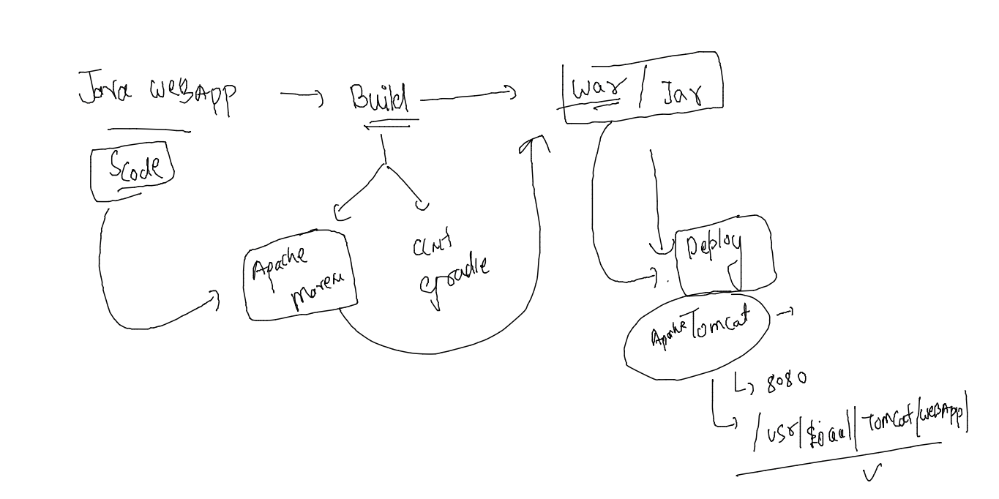

### Dockerfile multistage 

```
FROM oraclelinux:8.4 AS build-stage
LABEL name=ashutoshh
RUN yum install maven java-1.8.0-openjdk.x86_64 java-1.8.0-openjdk-devel.x86_64 -y
RUN mkdir /javaapp
COPY . /javaapp/
WORKDIR /javaapp
RUN mvn clean package
# output of above command target/WebApp.war 
FROM tomcat 
LABEL email=ashutoshh@linux.com 
COPY --from=build-stage /javaapp/target/WebApp.war /usr/local/tomcat/webapps/ 
EXPOSE 8080 

```

### .dockerignore

```
Dockerfile
.dockerignore
*.md
LICENSE
.git
```

### java-compose.yaml file 

```
version: '3.8'
services:
  ashuapp6:
    image: ashutomcat:v1 # this image will be build  
    build:  # build docker image 
      context: java-springboot # location of dockerfile 
    container_name: ashuc11111
    ports:
    - "1009:8080"
```

### running compose 

```
docker-compose -f  java-compose.yaml  up -d --build 
[+] Building 5.2s (6/13)                                                                           
 => [stage-1 1/2] FROM docker.io/library/tomcat@sha256:acbf4ace21d5a9bfca00865e615b3061c262b  4.8s
 => => sha256:d78b22b857e23a35f3f650f71006a3a0adf5bdd7d04896e916758fb645f88a 2.42kB / 2.42kB  0.0s
 => => sha256:52b67ab29b7461505b67976af1447cb3da0651874fd5d5466a75ba246dcd 12.85kB / 12.85kB  0.0s
 => => sha256:6d5c91c4cd86dde23108ab3af91e9eae838d0059a380ee7dfd4f370b6d98 54.58MB / 54.58MB  0.8s
 => => sha256:5e20d165240e4863f511ba9a1b730a75630545413cc7fee0c9eca825a3ad6b 5.42MB / 5.42MB  0.3s
 => => sha256:1334d60df9a8ba9ff6e8bf5f468941149156415ec2f1550d096a40e0fbdf096a 210B / 210B    0.3s
 => => sha256:16c2728dcd90d369747683d3c2de195d565c3f3
```

### 

```
[ashu@docker-client ashu-compose]$ docker-compose -f  java-compose.yaml ps
NAME                COMMAND             SERVICE             STATUS              PORTS
ashuc11111          "catalina.sh run"   ashuapp6            running             0.0.0.0:1009->8080/tcp, :::1009->8080/tcp
```

## Dockerfile - build -test / run / remove  after changes in source code 

### Intro continious Integration  (CI)

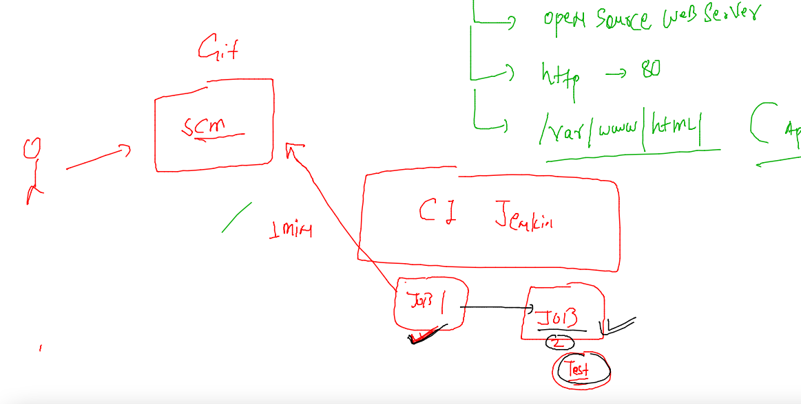

## build image from gitrepo -- manually 

```
 docker build  -t  ashuciapp:testv1  https://github.com/redashu/mobi-ashuapp.git 
Sending build context to Docker daemon   5.12kB
Step 1/3 : FROM nginx
latest: Pulling from library/nginx
42c077c10790: Pull complete 
62c70f376f6a: Pull complete 
915cc9bd79c2: Pull complete 
75a963e94de0: Pull complete 
7b1fab684d70: Pull complete 
db24d06d5af4: Pull complete 
Digest: sha256:2bcabc23b45489fb0885d69a06ba1d648aeda973fae7bb981bafbb884165e514
Status: Downloaded newer image for nginx:latest
 ---> 0e901e68141f
Step 2/3 : LABEL name=ashutoshh
 ---> Running in 47a4ab5523a0
Removing intermediate container 47a4ab5523a0
 ---> f478901e4493
Step 3/3 : COPY . /usr/share/nginx/html/
 ---> 6eb89dc167cb
Successfully built 6eb89dc167cb
Successfully tagged ashuciapp:testv1
[ashu@docker-client mobi-dockerimages]$ 
```

### Jenkins for automated CI 

### Jenkins installation link 

[install](https://www.jenkins.io/doc/book/installing/)


## problem in containers  wrt Container runtimes 

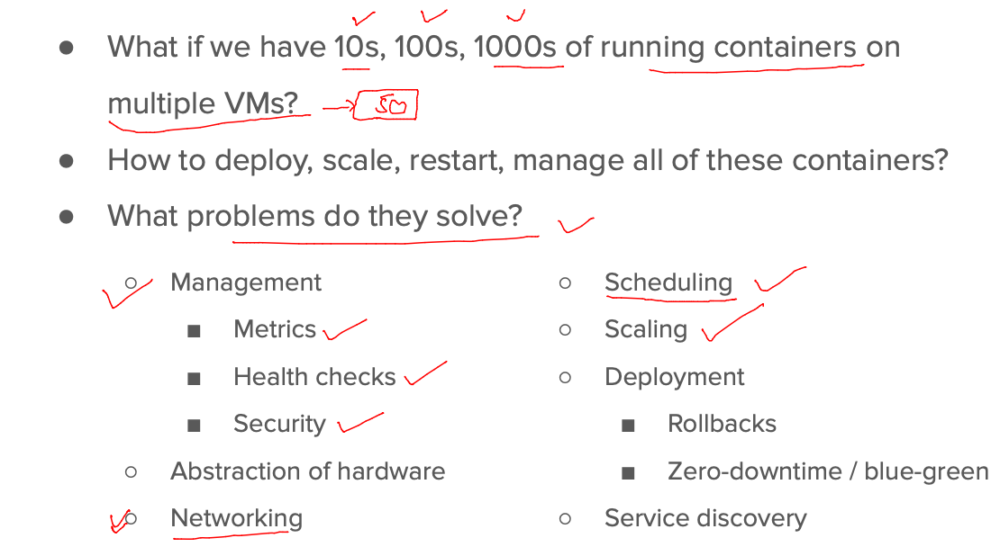

### options for solutions 

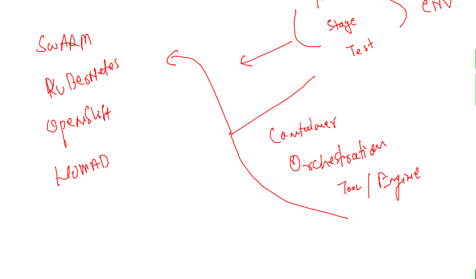

### Introduction to kubernetes -- 

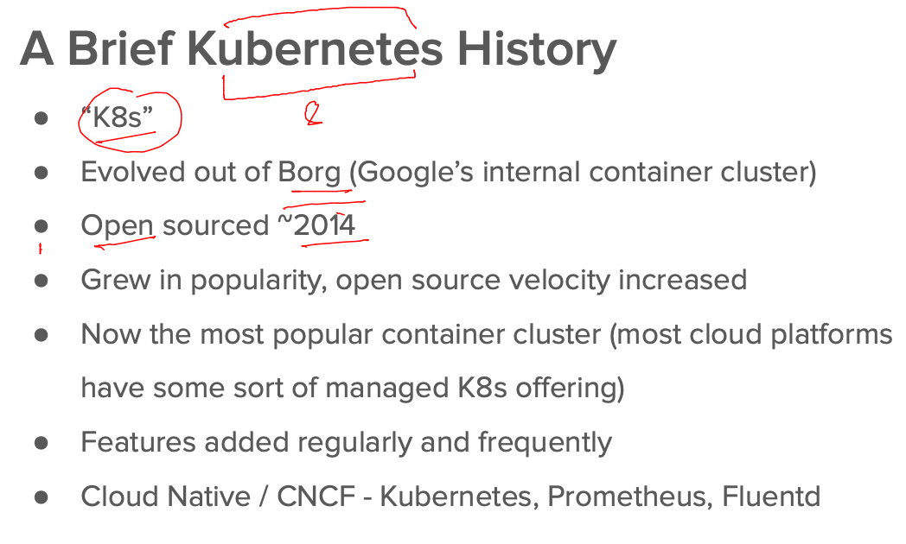

### k8s infra setup 

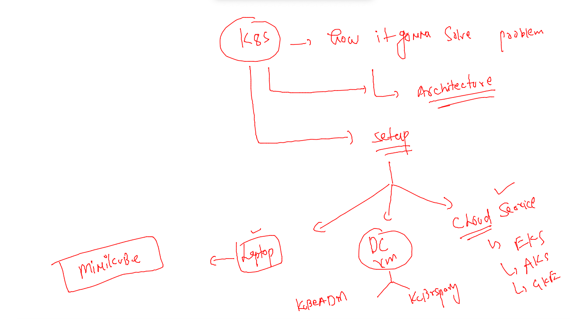

### Understanding k8s architecture 

### k8s client installation 

```
curl -LO "https://dl.k8s.io/release/$(curl -L -s https://dl.k8s.io/release/stable.txt)/bin/linux/amd64/kubectl"
  % Total    % Received % Xferd  Average Speed   Time    Time     Time  Current
                                 Dload  Upload   Total   Spent    Left  Speed
100   154  100   154    0     0   3623      0 --:--:-- --:--:-- --:--:--  3666
100 43.5M  100 43.5M    0     0   154M      0 --:--:-- --:--:-- --:--:--  154M
[root@docker-client ~]# ls
kubectl  users.txt
[root@docker-client ~]# mv kubectl  /usr/bin/
[root@docker-client ~]# chmod +x /usr/bin/kubectl 
[root@docker-client ~]# 

```

### verify 

```
 kubectl  version --client -o yaml 
clientVersion:
  buildDate: "2022-06-15T14:22:29Z"
  compiler: gc
  gitCommit: f66044f4361b9f1f96f0053dd46cb7dce5e990a8
  gitTreeState: clean
  gitVersion: v1.24.2
  goVersion: go1.18.3
  major: "1"
  minor: "24"
  platform: linux/amd64
kustomizeVersion: v4.5.4
```

### k8s architecture 

### level 1 

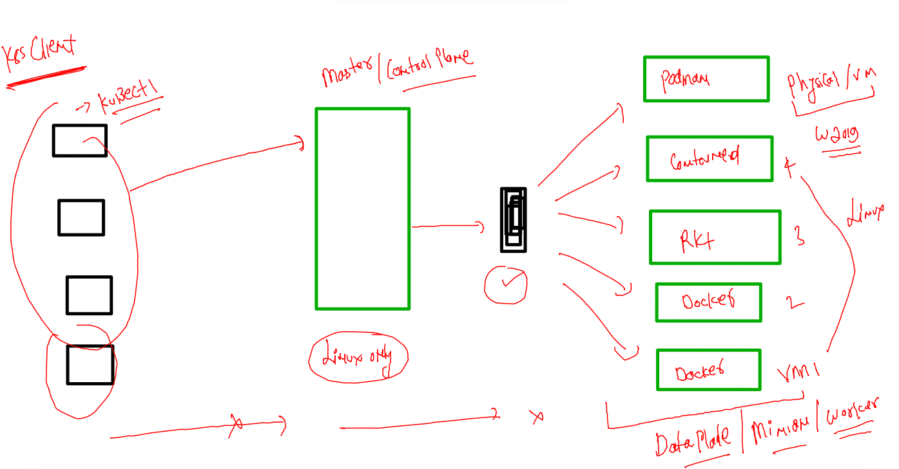

### level 2  kube-apiserver 

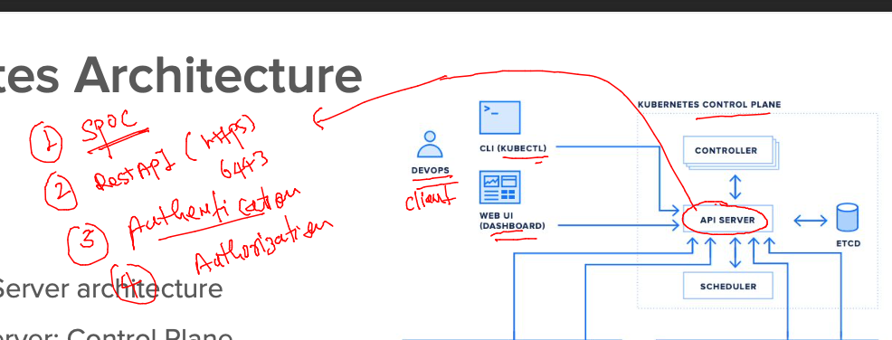

### on control plane auth file location 

```
/etc/kubernets/admin.conf 
```

### checking auth with client 

```
 kubectl   get  nodes 
The connection to the server localhost:8080 was refused - did you specify the right host or port?
[ashu@docker-client ~]$ 
[ashu@docker-client ~]$ kubectl   get  nodes --kubeconfig admin.conf 
NAME            STATUS   ROLES           AGE     VERSION
control-plane   Ready    control-plane   6h48m   v1.24.2
minion1         Ready    <none>          6h47m   v1.24.2
minion2         Ready    <none>          6h47m   v1.24.2
minion3         Ready    <none>          6h47m   v1.24.2
```

### alternative method 

```
 export KUBECONFIG=/home/ashu/admin.conf 
[ashu@docker-client ~]$ 
[ashu@docker-client ~]$ kubectl   get  nodes 
NAME            STATUS   ROLES           AGE     VERSION
control-plane   Ready    control-plane   6h51m   v1.24.2
minion1         Ready    <none>          6h50m   v1.24.2
minion2         Ready    <none>          6h50m   v1.24.2
minion3         Ready    <none>          6h50m   v1.24.2
```

### or 

```
 mkdir  ~/.kube 
mkdir: cannot create directory ‘/home/ashu/.kube’: File exists
[ashu@docker-client ~]$ 
[ashu@docker-client ~]$ ls
admin.conf  mobi-dockerimages
[ashu@docker-client ~]$ cp -v admin.conf   ~/.kube/config 
‘admin.conf’ -> ‘/home/ashu/.kube/config’
[ashu@docker-client ~]$ 
[ashu@docker-client ~]$ 
[ashu@docker-client ~]$ kubectl  get  nodes
NAME            STATUS   ROLES           AGE     VERSION
control-plane   Ready    control-plane   6h53m   v1.24.2
minion1         Ready    <none>          6h52m   v1.24.2
minion2         Ready    <none>          6h52m   v1.24.2
minion3         Ready    <none>          6h52m   v1.24.2
```


### Control plan componet 

```
[ashu@docker-client ~]$ kubectl   cluster-info 
Kubernetes control plane is running at https://172.31.14.121:6443
CoreDNS is running at https://172.31.14.121:6443/api/v1/namespaces/kube-system/services/kube-dns:dns/proxy

To further debug and diagnose cluster problems, use 'kubectl cluster-info dump'.
```

### etcd -- Nosql db for metadata --  key: value pair 

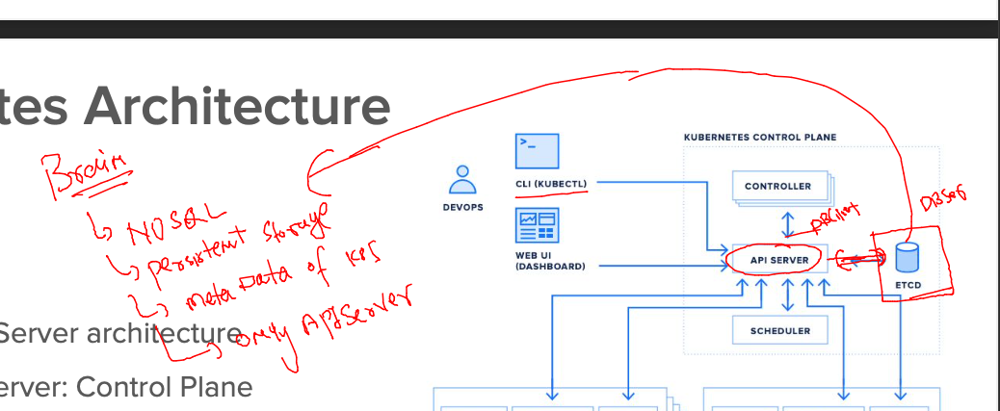

### components on Minion Side 

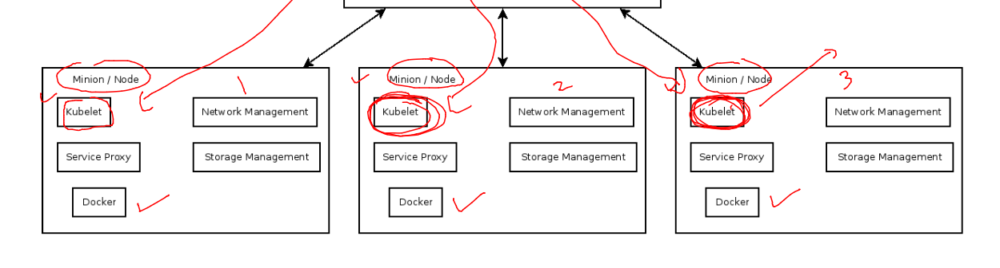


### how docker created containers 

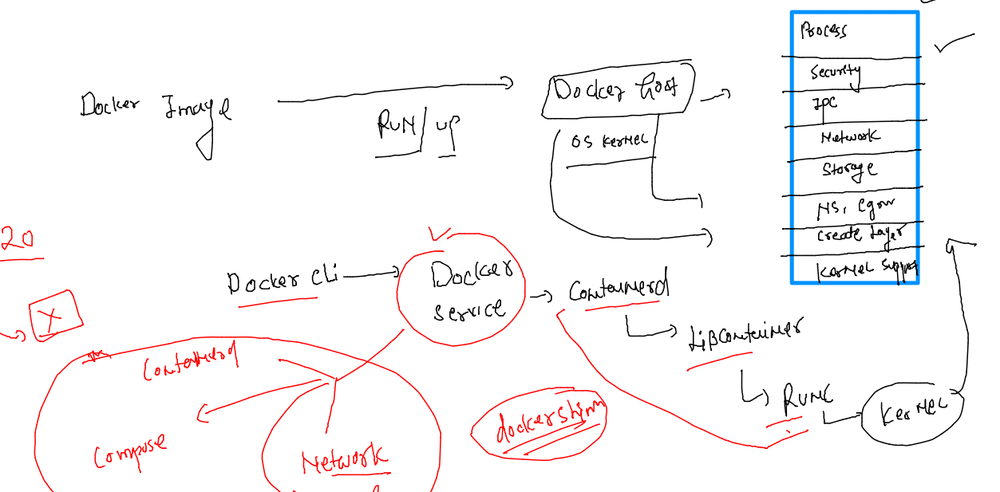


### POd introduction 

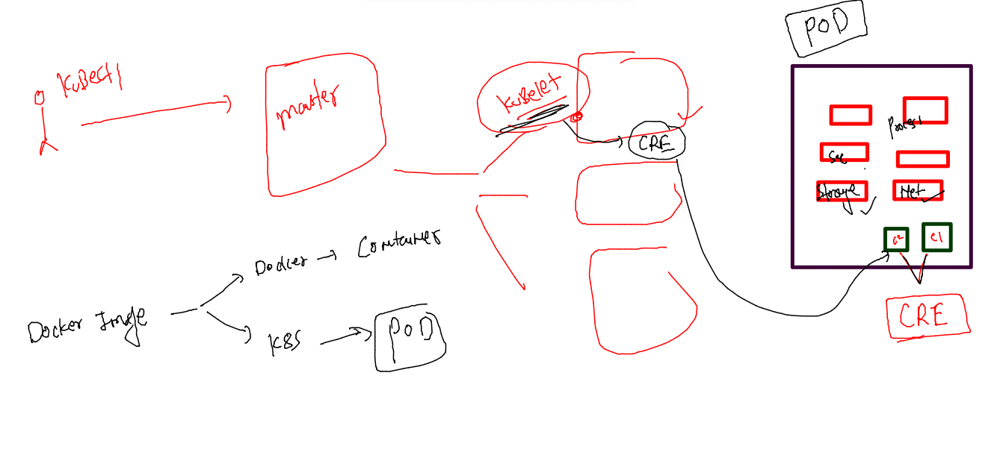


### Pod Design 

```
apiVersion: v1 # version of apiserver to accept pod related request
kind: Pod # in v1 apiserver we are targeting Pod 
metadata: # info about target 
  name: ashupod-123  # name of pod 
spec: # apps details 
  containers: 
  - name: ashuc1 # use can also it 
    image: alpine # image from docker hub 
    command: ["sh","-c","ping fb.com"] # process of container 
```

### send request 

```
[ashu@docker-client k8s-deploy-apps]$ ls
ashupod1.yaml
[ashu@docker-client k8s-deploy-apps]$ kubectl  get  pods
No resources found in default namespace.
[ashu@docker-client k8s-deploy-apps]$ kubectl  create  -f  ashupod1.yaml 
pod/ashupod-123 created
[ashu@docker-client k8s-deploy-apps]$ kubectl  get  pods
NAME          READY   STATUS              RESTARTS   AGE
ashupod-123   0/1     ContainerCreating   0          3s
[ashu@docker-client k8s-deploy-apps]$ kubectl  get  pods
NAME          READY   STATUS    RESTARTS   AGE
ashupod-123   1/1     Running   0          18s

```

### Some troubleshooting watchout 

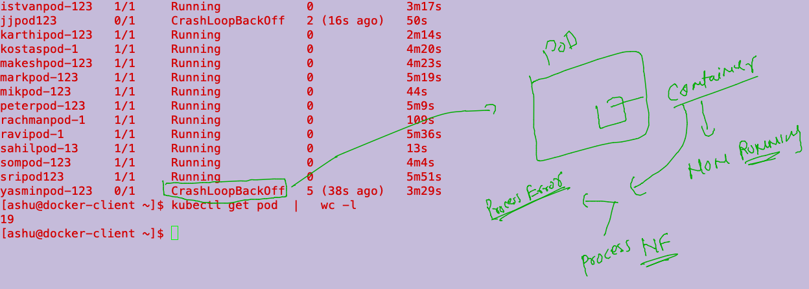

### job of kube-schedular 

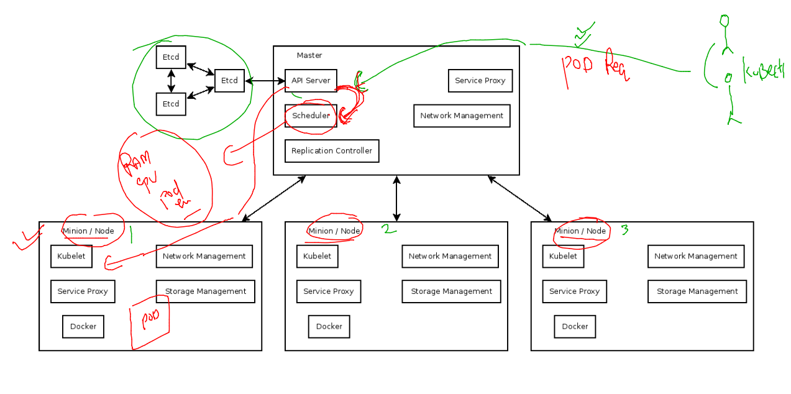

### more details about pod 

```
[ashu@docker-client ~]$ kubectl get  po   ashupod-123  -o wide 
NAME          READY   STATUS    RESTARTS   AGE   IP                NODE      NOMINATED NODE   READINESS GATES
ashupod-123   1/1     Running   0          17m   192.168.179.195   minion2   <none>           <none>
[ashu@docker-client ~]$ 


[ashu@docker-client ~]$ kubectl get  po -o wide 
NAME             READY   STATUS    RESTARTS   AGE     IP                NODE      NOMINATED NODE   READINESS GATES
abhipod-123      1/1     Running   0          15m     192.168.179.196   minion2   <none>           <none>
ashupod-123      1/1     Running   0          16m     192.168.179.195   minion2   <none>           <none>
barispod-123     1/1     Running   0          15m     192.168.50.197    minion3   <none>           <none>
calinpod-123     1/1     Running   0          67s     192.168.50.205    minion3   <none>           <none>
ferpod-123       1/1     Running   0          15m     192.168.34.5      minion1   <none>           <none>
jjpod123         1/1     Running   0          3m44s   192.168.50.204    minion3   <none>           <none>
karthipod-123    1/
```

### output of container process 

```
kubectl logs  ashupod-123
```

### access 

```
kubectl exec -it ashupod-123 -- sh 
/ # ls
bin    dev    etc    home   lib    media  mnt    opt    proc   root   run    sbin   srv    sys    tmp    usr    var
/ # whoami
root
/ # exit

```


