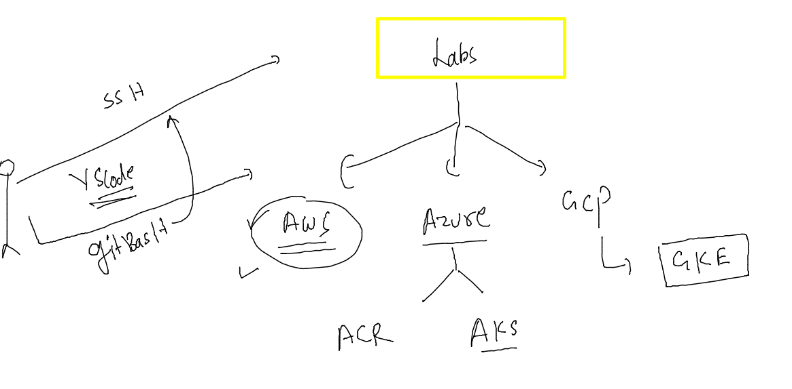
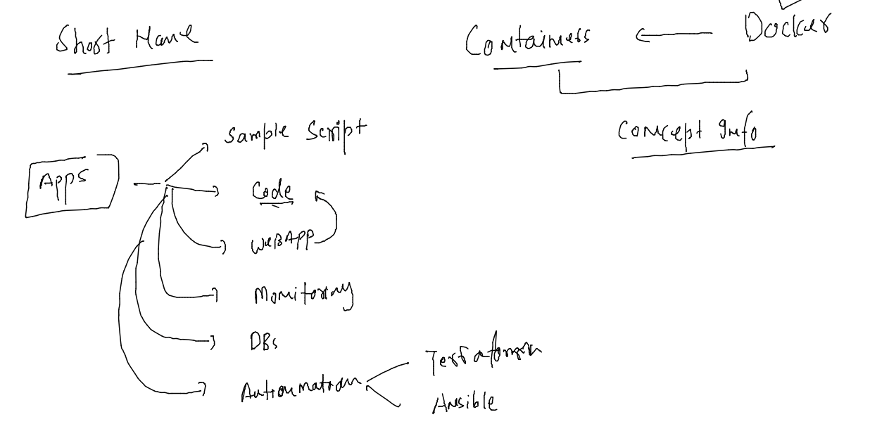
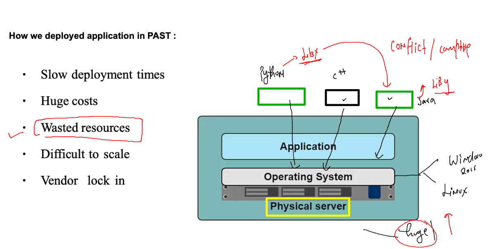
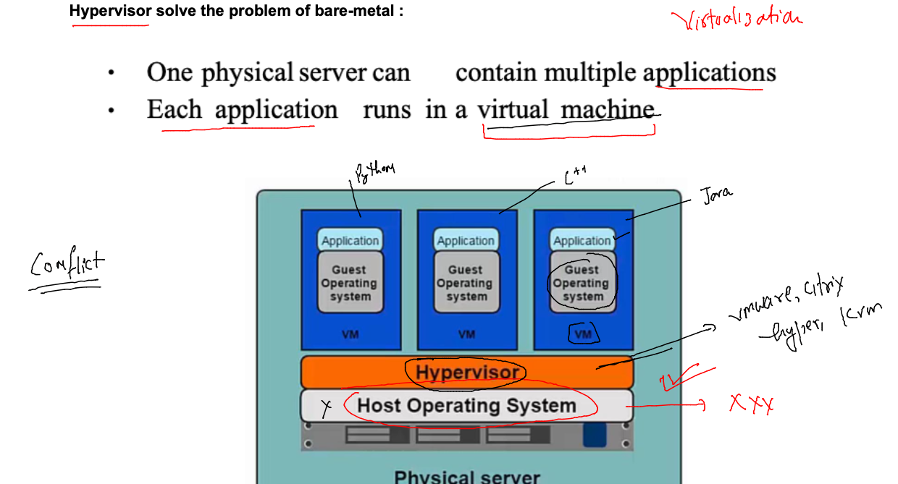
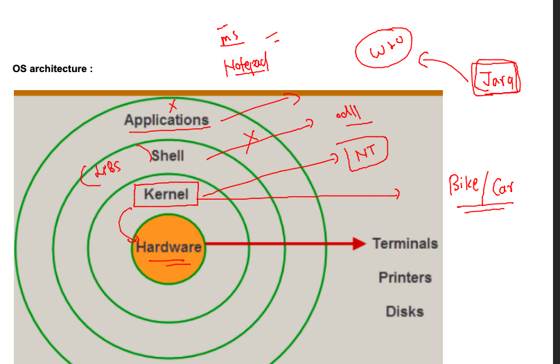
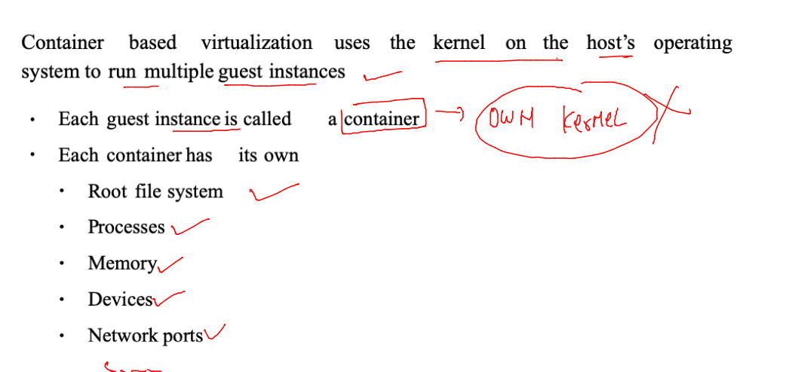
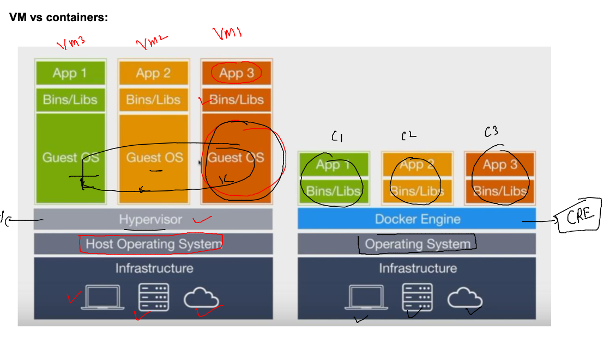
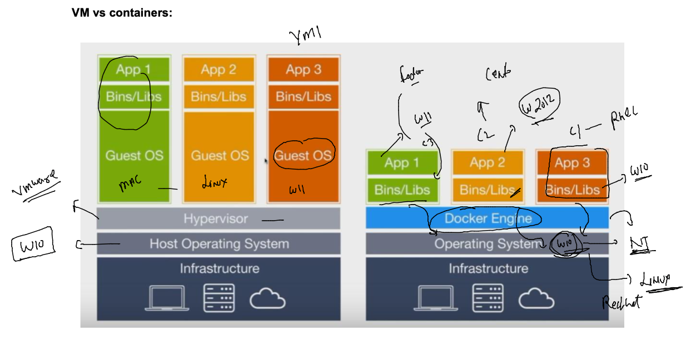
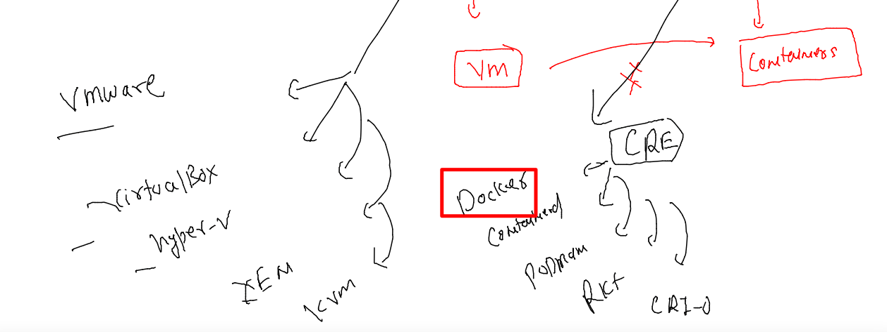

## training plan 

### labs 

### shortnames and other things 

### understanding problem in deploy /setup apps in bare-metal / hardware 

### wastage of resources 

### bare-metal -- to Hypervisor -- {virtualization}---vm

### down side of using VM 

### Understanding Os components 

## Introduction to containers 

### VM vs Continers 

### containers in more details 

### Introduction to container runtimes -- intro to Docker 

