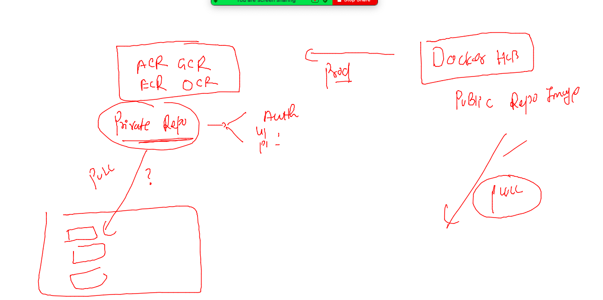
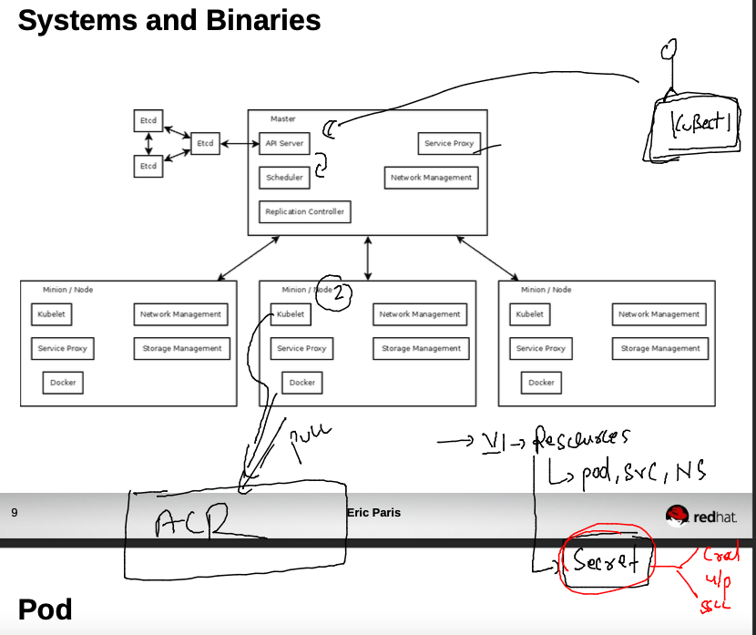
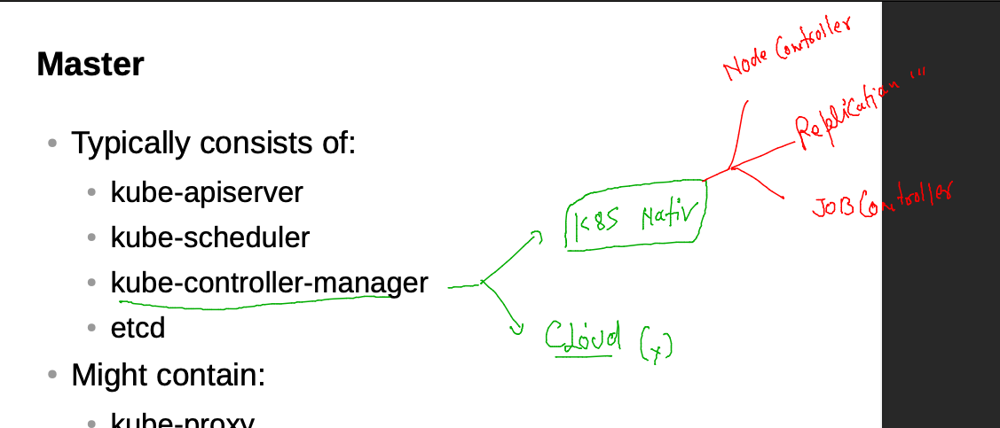
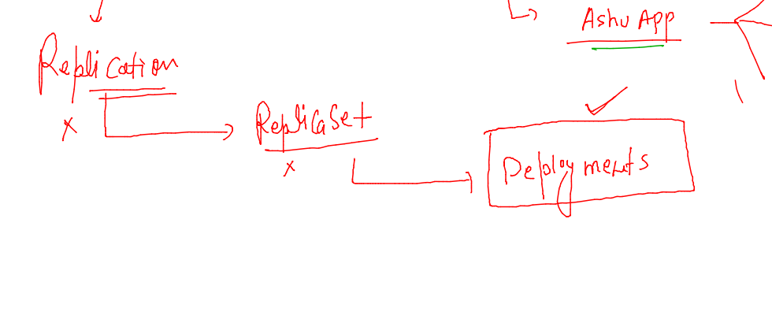

## training plan 


### getting started with Namespace and further deployments 

```
 kubectl config get-contexts 
CURRENT   NAME                          CLUSTER      AUTHINFO           NAMESPACE
*         kubernetes-admin@kubernetes   kubernetes   kubernetes-admin   ashu-project
[ashu@docker-client k8s-deploy-apps]$ kubectl get po 
No resources found in ashu-project namespace.
[ashu@docker-client k8s-deploy-apps]$ kubectl get svc
No resources found in ashu-project namespace.
[ashu@docker-client k8s-deploy-apps]$ 

```

### redeploy pod in custom namespace 

```
kubectl create -f  customerapp.yaml 
pod/ashucustomer created
[ashu@docker-client k8s-deploy-apps]$ kubectl get pods
NAME           READY   STATUS    RESTARTS   AGE
ashucustomer   1/1     Running   0          5s
[ashu@docker-client k8s-deploy-apps]$ kubectl get pods -owide
NAME           READY   STATUS    RESTARTS   AGE   IP               NODE      NOMINATED NODE   READINESS GATES
ashucustomer   1/1     Running   0          8s    192.168.50.212   minion3   <none>           <none>
[ashu@docker-client k8s-deploy-apps]$ kubectl get pods --show-labels 
NAME           READY   STATUS    RESTARTS   AGE   LABELS
ashucustomer   1/1     Running   0          17s   x1=helloashu
```

### creating service using two diff methods 

```
 964  kubectl get po --show-labels 
  965  kubectl  create  service nodeport  ashulb2 --tcp 1234:80 --dry-run=client -oyaml 
  966  kubectl  expose  pod  ashucustomer  --type NodePort --port 1234 --target-port 80 --name ashulb2 --dry-run=client -o yaml 

```

### creating service 

```
      6s    192.168.34.19   minion1   <none>           <none>
[ashu@docker-client k8s-deploy-apps]$ kubectl  get po --show-labels 
NAME           READY   STATUS    RESTARTS   AGE     LABELS
ashucustomer   1/1     Running   0          2m34s   x1=helloashu
[ashu@docker-client k8s-deploy-apps]$ kubectl  expose pod ashucustomer  --type NodePort --port 1234 --target-port 80 --name ashulb2  --dry-run=client -o yaml >nodeport2.yaml 
[ashu@docker-client k8s-deploy-apps]$ kubectl create -f nodeport2.yaml 
service/ashulb2 created
[ashu@docker-client k8s-deploy-apps]$ kubectl get svc 
NAME      TYPE       CLUSTER-IP      EXTERNAL-IP   PORT(S)          AGE
ashulb2   NodePort   10.106.214.42   <none>        1234:31141/TCP   4s
[ashu@docker-client k8s-deploy-apps]$ kubectl get svc -owide
NAME      TYPE       CLUSTER-IP      EXTERNAL-IP   PORT(S)          AGE   SELECTOR
ashulb2   NodePort   10.106.214.42   <none>        1234:31141/TCP   7s    x1=helloashu
[ashu@docker-client k8s-deploy-apps]$ 
```

### deploy images in k8s from private Image registry 



### pushing image to azure registry 

```
 docker  tag  34a1284ffa7d   ashumobi.azurecr.io/ashuwebapp:mobiv1 
[ashu@docker-client ~]$ docker login  ashumobi.azurecr.io
Username: ashumobi
Password: 
WARNING! Your password will be stored unencrypted in /home/ashu/.docker/config.json.
Configure a credential helper to remove this warning. See
https://docs.docker.com/engine/reference/commandline/login/#credentials-store

Login Succeeded
[ashu@docker-client ~]$ docker  push  ashumobi.azurecr.io/ashuwebapp:mobiv1
The push refers to repository [ashumobi.azurecr.io/ashuwebapp]
12a632c0d0fc: Pushed 
5c97fe79528e: Pushed 
a2c0a58ca198: Pushed 
aa82b2380804: Pushed 
3b4f4d6ea52e: Pushed 
2d97fb64a09c: Pushed 
2d3586eacb61: Pushed 
mobiv1: digest: sha256:6cd090cc218a170f5a9039756afe0b21c5f7040fe85167d72b3890c476f00191 size: 1787
[ashu@docker-client ~]$ docker logout  ashumobi.azurecr.io
Removing login credentials for ashumobi.azurecr.io
[ashu@docker-client ~]$ 

```

### lets deploy pod in k8s 

```
kubectl run  ashusecureapp --image=ashumobi.azurecr.io/ashuwebapp:mobiv1  --port 80         --dry-run=client -o yaml  >azureimage.yaml 
[ashu@docker-client k8s-deploy-apps]$ kubectl create -f  azureimage.yaml 
pod/ashusecureapp created
[ashu@docker-client k8s-deploy-apps]$ kubectl   get  po
NAME            READY   STATUS         RESTARTS   AGE
ashusecureapp   0/1     ErrImagePull   0          4s
[ashu@docker-client k8s-deploy-apps]$ 
```

### intro to secret resource in k8s for confidential storage 



### type of secret 

```
kubectl  create   secret  
Create a secret using specified subcommand.

Available Commands:
  docker-registry   Create a secret for use with a Docker registry
  generic           Create a secret from a local file, directory, or literal value
  tls               Create a TLS secret

Usage:
```
### creating docker-registry type of secret to store any registry creds 

```
kubectl  create   secret  docker-registry ashuappsec1  --docker-server=ashumobi.azurecr.io  --docker-username="ashumobi"  --docker-password="GGb/avJ6o"  --dry-run=client -o yaml 
apiVersion: v1
data:
  .dockerconfigjson: eyJhdXRocyI6eyJhc2h1bW9iaS5henVyZWNyLmlvIjp7InVzZXJuYW1lIjoiYXNodW1vYmkiLCJwYXNzd29yZCI6IkdHYi9hdko1QW14ejRPd0IwSzFFb1M4WThEbmRDRzZvIiwiYXV0aCI6IllY
```

### yAML file for secret 

```
kubectl  create   secret  docker-registry ashuappsec1  --docker-server=ashumobi.azurecr.io  --docker-username="ashumobi"  --docker-password="GGb/avJ5Amxz4OwB0K1EoS8Y8DndCG6o"  --dry-run=client -o yaml  >secret1.yaml 
```

### 

```
kubectl create  -f  secret1.yaml 
secret/ashuappsec1 created
[ashu@docker-client k8s-deploy-apps]$ kubectl get  secret 
NAME          TYPE                             DATA   AGE
ashuappsec1   kubernetes.io/dockerconfigjson   1      5s
[ashu@docker-client k8s-deploy-apps]$ 
```

### lets use this secret in Pod 

### YAML 

```
apiVersion: v1
kind: Pod
metadata:
  creationTimestamp: null
  labels:
    run: ashusecureapp
  name: ashusecureapp
spec:
  imagePullSecrets: # to call secret in pod 
  - name: ashuappsec1 # name of secret 
  containers:
  - image: ashumobi.azurecr.io/ashuwebapp:mobiv1
    name: ashusecureapp
    ports:
    - containerPort: 80
    resources: {}
  dnsPolicy: ClusterFirst
  restartPolicy: Always
status: {}

```

## Deploy it 

```
kubectl replace  -f  azureimage.yaml --force 
pod "ashusecureapp" deleted
pod/ashusecureapp replaced
[ashu@docker-client k8s-deploy-apps]$ kubectl  get  po 
NAME            READY   STATUS              RESTARTS   AGE
ashusecureapp   0/1     ContainerCreating   0          12s
[ashu@docker-client k8s-deploy-apps]$ kubectl  get  po 
NAME            READY   STATUS              RESTARTS   AGE
ashusecureapp   0/1     ContainerCreating   0          25s
[ashu@docker-client k8s-deploy-apps]$ 
```
### merging yaml 

```
# lets write secret yaml first 
apiVersion: v1
data:
  .dockerconfigjson: eyJhdXRocyI6eyJhc2h1bW9iaS5henVyZWNyLmlvIjp7InVzZXJuYW1lIjoiYXNodW1vYmkiLCJwYXNzd29yZCI6IkdHYi9hdko1QW14ejRPd0IwSzFFb1M4WThEbmRDRzZvIiwiYXV0aCI6IllYTm9kVzF2WW1rNlIwZGlMMkYyU2pWQmJYaDZORTkzUWpCTE1VVnZVemhaT0VSdVpFTkhObTg9In19fQ==
kind: Secret
metadata:
  creationTimestamp: null
  name: ashuappsec1
type: kubernetes.io/dockerconfigjson

# lets write pod yaml 
---
apiVersion: v1
kind: Pod
metadata:
  creationTimestamp: null
  labels: # label of pods 
    run: ashusecureapp
  name: ashusecureapp
spec:
  imagePullSecrets: # to call secret in pod 
  - name: ashuappsec1 # name of secret 
  containers:
  - image: ashumobi.azurecr.io/ashuwebapp:mobiv1
    name: ashusecureapp
    ports:
    - containerPort: 80
    resources: {}
  dnsPolicy: ClusterFirst
  restartPolicy: Always
status: {}

# lets create service nOdePort 
---
apiVersion: v1
kind: Service
metadata:
  creationTimestamp: null
  labels:
    app: ashuapplb1
  name: ashuapplb1
spec:
  ports:
  - name: 1234-80
    port: 1234
    protocol: TCP
    targetPort: 80
  selector: # we need to write labels of pod 
    run: ashusecureapp 
  type: NodePort
status:
  loadBalancer: {}

```


### deploy it in another way 

```
kubectl create -f  ashuazureapp.yaml 
secret/ashuappsec1 created
pod/ashusecureapp created
service/ashuapplb1 created
[ashu@docker-client k8s-deploy-apps]$ kubectl  get secret 
NAME          TYPE                             DATA   AGE
ashuappsec1   kubernetes.io/dockerconfigjson   1      4s
[ashu@docker-client k8s-deploy-apps]$ kubectl  get po --show-labels 
NAME            READY   STATUS    RESTARTS   AGE   LABELS
ashusecureapp   1/1     Running   0          12s   run=ashusecureapp
[ashu@docker-client k8s-deploy-apps]$ kubectl  get  svc -o wide 
NAME         TYPE       CLUSTER-IP    EXTERNAL-IP   PORT(S)          AGE   SELECTOR
ashuapplb1   NodePort   10.99.4.199   <none>        1234:30069/TCP   19s   run=ashusecureapp
[ashu@docker-client k8s-deploy-apps]$ 

```

### lets not deploy container image in POd 

```
<<X  Problem with Pods 
> 
> 1. they can't move minion1 - minion2 
> 2. self healing 
> 3. scaling horizental 

```

### Controllers in k8s 



### Deployment in k8s 




