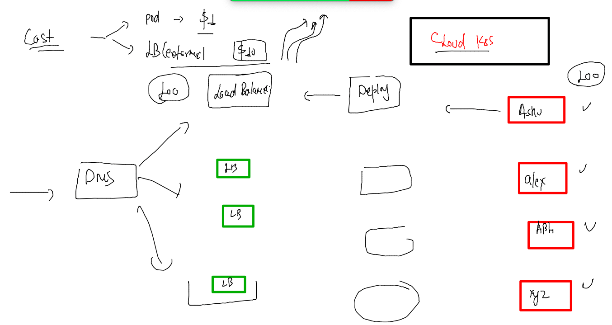
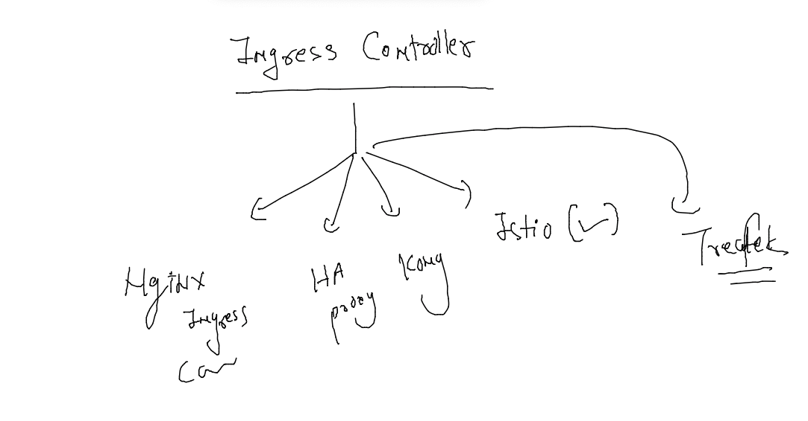

## training plan 


### deploy app in prod env -- and problem with external LB 



### ingress products 



### Deploy Ingress 

```
 kubectl apply -f https://raw.githubusercontent.com/kubernetes/ingress-nginx/controller-v1.2.0/deploy/static/provider/baremetal/deploy.yaml
namespace/ingress-nginx created
serviceaccount/ingress-nginx created
serviceaccount/ingress-nginx-admission created
role.rbac.authorization.k8s.io/ingress-nginx created
role.rbac.authorization.k8s.io/ingress-nginx-admission created
clusterrole.rbac.authorization.k8s.io/ingress-nginx unchanged
clusterrole.rbac.authorization.k8s.io/ingress-nginx-admission unchanged
rolebinding.rbac.authorization.k8s.io/ingress-nginx created
rolebinding.rbac.authorization.k8s.io/ingress-nginx-admission
```

### lets verify 

```
kubectl get  deploy -n ingress-nginx
NAME                       READY   UP-TO-DATE   AVAILABLE   AGE
ingress-nginx-controller   1/1     1            1           50s
[ashu@docker-client mobi-dockerimages]$ kubectl get  rs  -n ingress-nginx
NAME                                  DESIRED   CURRENT   READY   AGE
ingress-nginx-controller-6b864cf6dd   1         1         1       64s
[ashu@docker-client mobi-dockerimages]$ kubectl get  po  -n ingress-nginx
NAME                                        READY   STATUS      RESTARTS   AGE
ingress-nginx-admission-create-r6wm8        0/1     Completed   0          72s
ingress-nginx-admission-patch-gbnhr         0/1     Completed   1          72s
ingress-nginx-controller-6b864cf6dd-6d4bw   1/1     Running     0          72s
[ashu@docker-client mobi-dockerimages]$ kubectl get  svc  -n ingress-nginx
NAME                                 TYPE        CLUSTER-IP       EXTERNAL-IP   PORT(S)                      AGE
ingress-nginx-controller             NodePort    10.106.192.32    <none>        80:31034/TCP,443:32642/TCP   95s
ingress-nginx-controller-admission   ClusterIP   10.108.180.148   <none>        443/TCP                      95s
[ashu@docker-client mobi-dockerimages]$ 
```

### changes in container 

```
docker  exec -it  ashuc1 bash 
root@c4b20f5bf5f4:/# 
root@c4b20f5bf5f4:/# 
root@c4b20f5bf5f4:/# cd /usr/share/nginx/html/
root@c4b20f5bf5f4:/usr/share/nginx/html# apt udpate ; apt install vim -y ^C
root@c4b20f5bf5f4:/usr/share/nginx/html# ls
50x.html  dog.jpg  index.html
root@c4b20f5bf5f4:/usr/share/nginx/html# cat  index.html 
<!DOCTYPE html>
<html lang="en">
<head>
    <meta charset="UTF-8">
    <meta http-equiv="X-UA-Compatible" content="IE=edge">
    <meta name="viewport" content="width=device-width, initial-scale=1.0">
    <title>ashu</title>
</head>
<body>
    <h1> i am ashu and i love dogs  </h1>
    
    
</body>
</html>
```

### changing a running container into docker image 

```
docker  commit  ashuc1  dockerashu/ashuapp:dogv1 
sha256:461d08a6358cf20911e82f476a37efa97674ad508042bfd6022dbc156e11866d
[ashu@docker-client mobi-dockerimages]$ 
[ashu@docker-client mobi-dockerimages]$ docker login -u dockerashu
Password: 
WARNING! Your password will be stored unencrypted in /home/ashu/.docker/config.json.
Configure a credential helper to remove this warning. See
https://docs.docker.com/engine/reference/commandline/login/#credentials-store

Login Succeeded
[ashu@docker-client mobi-dockerimages]$ docker push dockerashu/ashuapp:dogv1
The push refers to repository [docker.io/dockerashu/ashuapp]
0d570e5bfe27: Pushed 
31905c988dca: Mounted from dockerashu/dog 
431a31bd0b21: Mounted from dockerashu/dog 
```

### application deploy with nginx 

### create deployment 

```
 mkdir ingress-demo 
[ashu@docker-client k8s-deploy-apps]$ cd ingress-demo/
[ashu@docker-client ingress-demo]$ 
[ashu@docker-client ingress-demo]$ kubectl create deployment ashuapp --image=dockerashu/ashuapp:dogv1    --port 80  
deployment.apps/ashuapp created
[ashu@docker-client ingress-demo]$ kubectl get deploy 
NAME      READY   UP-TO-DATE   AVAILABLE   AGE
ashuapp   1/1     1            1           20s
[ashu@docker-client ingress-demo]$ 

```

### creating service 

```
kubectl get deploy 
NAME      READY   UP-TO-DATE   AVAILABLE   AGE
ashuapp   1/1     1            1           2m50s
[ashu@docker-client ingress-demo]$ kubectl expose deploy ashuapp --type ClusterIP --port 80 --name  ashulb1 
service/ashulb1 exposed
[ashu@docker-client ingress-demo]$ kubectl get svc
NAME      TYPE        CLUSTER-IP       EXTERNAL-IP   PORT(S)   AGE
ashulb1   ClusterIP   10.102.175.126   <none>        80/TCP    4s
```

### Ingress rule 

```
apiVersion: networking.k8s.io/v1
kind: Ingress
metadata:
  name: ashu-ingress-rule
  annotations:
    nginx.ingress.kubernetes.io/rewrite-target: /
spec:
  ingressClassName: nginx
  rules:
  - host: www.ashumobi.com
    http:
      paths:
      - path: /
        pathType: Prefix
        backend:
          service:
            name: ashulb1
            port:
              number: 80
```

### deploy it 

```
kubectl apply -f rule.yaml 
ingress.networking.k8s.io/ashu-ingress-rule created
[ashu@docker-client ingress-demo]$ kubectl get ingress 
NAME                CLASS   HOSTS              ADDRESS   PORTS   AGE
ashu-ingress-rule   nginx   www.ashumobi.com             80      11s
[ashu@docker-client ingress-demo]$ kubectl get ingress 
NAME                CLASS   HOSTS              ADDRESS         PORTS   AGE
ashu-ingress-rule   nginx   www.ashumobi.com   172.31.11.164   80      38s
[ashu@docker-client ingress-demo]$ 

```


