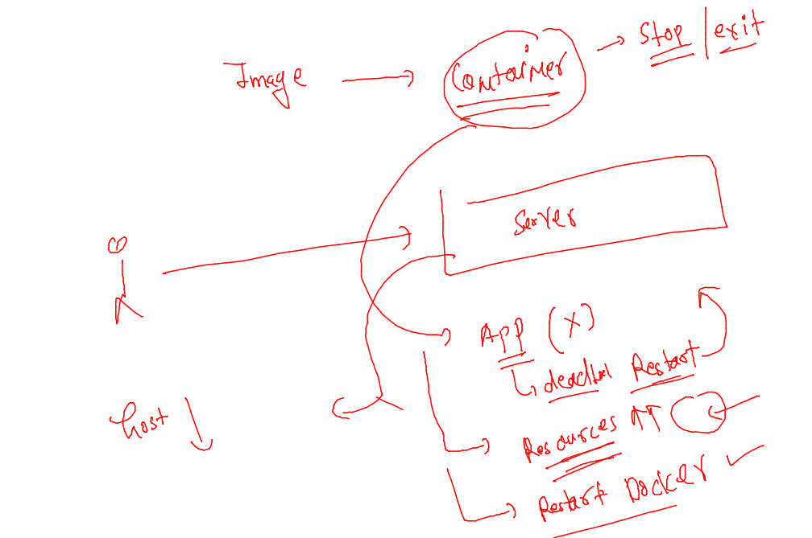
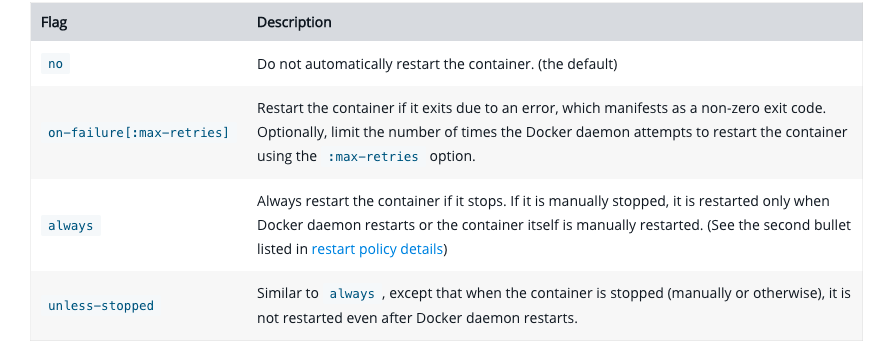
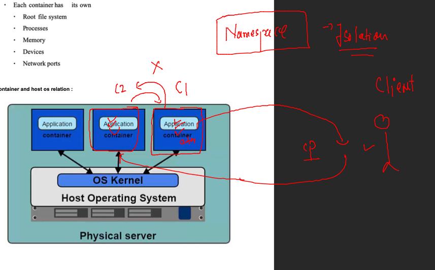
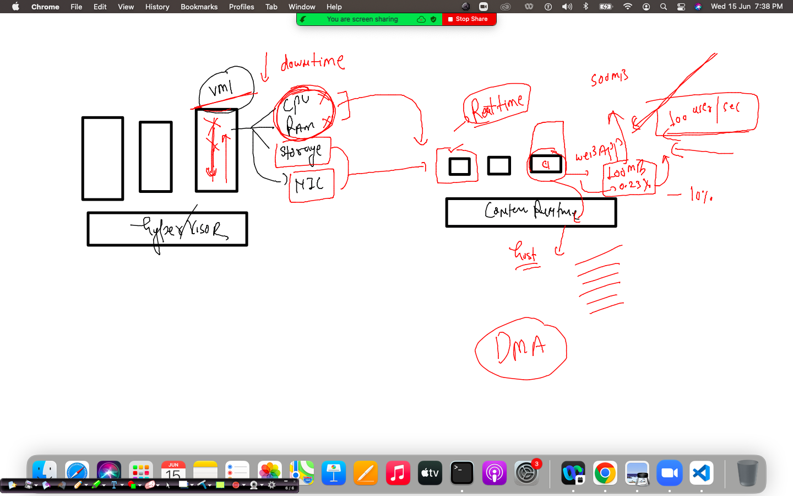

## training plan 


## python based docker image assignment 

### Dockerfile 

```
from alpine 
LABEL email=ashutoshh@linux.com 
RUN apk add python3 
RUN mkdir  /code 
ADD https://raw.githubusercontent.com/redashu/pythonLang/main/while.py /code/ 
# copy and add both are same but add support URL sources also 
ENTRYPOINT python3 /code/while.py 
# ENTrypoint is same as CMD 
```

### image build 

```
docker  build  -t ashualp:pycodev1 -f  alpine.dockerfile  . 

```

### creating container and checking logs 

```
220  docker run -itd --name ashutest1  ashualp:pycodev1 
  221  docker logs  ashutest1
```

### tips 

```
ashu@docker-client ~]$ docker  image  prune 
WARNING! This will remove all dangling images.
Are you sure you want to continue? [y/N] y
Deleted Images:
deleted: sha256:d35131a5ee79243d462185d9769ed2bee8bc10e7173e05714f2451bf90c88d19
deleted: sha256:a96db9163c19529b92443dbfa18b938c2a9db9d4dd1dc81a524a618e1986253f
deleted: sha256:a95e
```

### linux based distro and their software installer


### Default process


```
from alpine 
LABEL email=ashutoshh@linux.com 
RUN apk add python3 
RUN mkdir  /code 
ADD https://raw.githubusercontent.com/redashu/pythonLang/main/while.py /code/ 
COPY . /code/
# copy and add both are same but add support URL sources also 
WORKDIR /code 
# change working directory to this 
ENTrypoint ["python3"]
CMD ["while.py"]

# ENTrypoint is same as CMD 
```

### dockeringore file 

```
Dockerfile
*.dockerfile
.dockerignore

```

### to create containers 

```
docker  run -itd --name ashuc3 ashualp:v3
docker  run -itd --name ashuc4 ashualp:v3 mobi.py 

```

## java sample code 

### example 1. 

```
class myclass { 
    public static void main(String args[]) 
    { 
        // test expression 
        while (true) { 
            System.out.println("Hello World this is ashu "); 
  
            // update expression 
        } 
    } 
} 
```

### Dockerfile 

```
FROM openjdk
LABEL name=ashutoshh
RUN mkdir /javacode 
ADD ashu.java /javacode/
WORKDIR  /javacode
# changing directory during image build time
RUN javac ashu.java 
# compiling code 
CMD ["java","myclass"]
# to run we need class name 
# to fix default process for this docker image


```

### lets build it  and check 

```
[ashu@docker-client java_images]$ ls
ashu.java  Dockerfile
[ashu@docker-client java_images]$ docker build -t  ashujava:codev1 . 
Sending build context to Docker daemon  3.072kB
Step 1/7 : FROM openjdk
 ---> b83a192caadf
Step 2/7 : LABEL name=ashutoshh
 ---> Running in a8b6f79b9a92
Removing intermediate container a8b6f79b9a92
 ---> 12e429b985dd
Step 3/7 : RUN mkdir /javacode
 ---> Running in dd5be33c52bd
Removing intermediate container dd5be33c52bd
 ---> 1d5b1de5260c
Step 4/7 : ADD ashu.java /javacode/
 ---> 666cc7a8270b
Step 5/7 : WORKDIR  /javacode
 ---> Running in 5814d65f8dab
Removing intermediate container 5814d65f8dab
 ---> c77858cbff16
Step 6/7 : RUN javac ashu.java
 ---> Running in bac6601899bf
Removing intermediate container bac6601899bf
 ---> 90c2a826a762
Step 7/7 : CMD ["java","myclass"]
 ---> Running in 5f0601366515
Removing intermediate container 5f0601366515
 ---> 080b91be95cc
Successfully built 080b91be95cc
Successfully tagged ashujava:codev1
```

### testing 

```
 docker images   |   grep ashu 
ashujava          codev1       080b91be95cc   About a minute ago       464MB
ashualp           v3           fbe84c010e76   53 minutes ago           55.8MB
ashualp           cmd          db648b59f2e2   About an hour ago        55.8MB
ashualp           entrypoint   8faa606992bf   About an hour ago        55.8MB
ashualp           pycodev1     8faa606992bf   About an hour ago        55.8MB
ashupython        v2           0787903ace71   2 hours ago              142MB
ashupython        v1           7014c4eb0648   2 hours ago              920MB
[ashu@docker-client ~]$ docker  run -itd --name ashujc1  080b91be95cc 
418843ddbe80bc1d66fe5db529ea1f1bffafcd6f38babb8cdbc2edc2e06232e6
[ashu@docker-client ~]$ docker  ps
CONTAINER ID   IMAGE             COMMAND           CREATED              STATUS              PORTS     NAMES
418843ddbe80   080b91be95cc      "java myclass"    4 seconds ago        Up 2 seconds                  ashujc1
783a930bbbe6   yasminjava:v1     "java myclass"    32 seconds ago       Up 26 seconds                 c1
de3b8d004884   sarkany-java:v1   "java Sample"     About a minute ago   Up About a minute             sarkanyc1
6a23f497897f   barisjava:v1      "java baris"      3 minutes ago        Up 3 minutes                  barisjavac
351361e13f6e   abhijava:v1       "java abhishek"   4 minutes ago        Up 4 minutes                  abhijavac1
8b4b2a4fa3ab   peterjava:v1      "java peter"      4 minutes ago        Up 4 minutes                  peterj1
[ashu@docker-client ~]$ docker  logs  ashujc1 
Hello World this is ashu 
Hello World this is ashu 
Hello World this is ashu 
Hello World this is ashu 
Hello World this is ashu 

```


### we can replace entrypoint also 

```
docker  run -it  --entrypoint cal        8faa606992bf 
     June 2022
Su Mo Tu We Th Fr Sa
          1  2  3  4
 5  6  7  8  9 10 11
12 13 14 15 16 17 18
19 20 21 22 23 24 25
26 27 28 29 30

```

### Dockerfile for shell scripting 

### 

```
FROM oraclelinux:8.4
LABEL email=ashutoshh@linux.com
ENV un=ramesh
# use of ENV in dockerfile to set some env variable with default value
RUN mkdir /code 
COPY test.sh /code/
WORKDIR /code
RUN chmod +x test.sh 
ENTRYPOINT ["./test.sh"]

```

==

```
#!/bin/bash

if  [ "$un" == "ashu"  ]
then
    echo "Hello $un .."
    echo "running few commands .."
    date ; ls 
    sleep 10 

elif  [ "$un" == "jack"  ]
then
    echo "Hey $un "
    cal  ; uptime 
    sleep 10 

else 
    echo "hey $un nice to see you here.."
    uptime 
    sleep 10 
fi 
```

### after build lets test 

```
docker run -it --rm  ashu:shellv1  
hey ramesh nice to see you here..
 10:36:51 up  3:13,  0 users,  load average: 0.80, 0.38, 1.75
[ashu@docker-client ~]$ docker run -it --rm  -e un=ashu      ashu:shellv1  
Hello ashu ..
running few commands ..
Wed Jun 15 10:37:51 UTC 2022
test.sh
[ashu@docker-client ~]$ docker run -it --rm  -e un=jack     ashu:shellv1  
Hey jack 
      June 2022     
Su Mo Tu We Th Fr Sa
          1  2  3  4
 5  6  7  8  9 10 11
12 13 14 15 16 17 18
19 20 21 22 23 24 25
26 27 28 29 30      
                    
 10:38:10 up  3:15,  0 users,  load average: 0.33, 0.32, 1.62
```

### sharing image to diff docker hosts 


### info about registry 


### tag image 

```
docker tag  ashu:shellv1   docker.io/dockerashu/ashu:shellv1
```

### login to docker hub account 

```
docker login 
Login with your Docker ID to push and pull images from Docker Hub. If you don't have a Docker ID, head over to https://hub.docker.com to create one.
Username: dockerashu
Password: 
WARNING! Your password will be stored unencrypted in /home/ashu/.docker/config.json.
Configure a credential helper to remove this warning. See
https://docs.docker.com/engine/reference/commandline/login/#credentials-store

Login Succeeded
```

### push 

```
docker  push  docker.io/dockerashu/ashu:shellv1
The push refers to repository [docker.io/dockerashu/ashu]
cc796ffa507c: Pushed 
8484bebc3141: Pushed 
8e78bc30dee3: Pushed 
2d3586eacb61: Mounted from library/oraclelinux 
shellv1: digest: sha256:2f1437e13d1b302a11c4ef4057c8672532f05df36cd24a2ad7ad2ecdef832d5f size: 1150
[ashu@docker-client shellscript]$ 

```

### logout 

```
 docker logout 
Removing login credentials for https://index.docker.io/v1/
[ashu@docker-client shellscript]$ 
```

### pushing image to Azure container registry  

```

 docker  tag  ashu:shellv1  mobashutoshh.azurecr.io/mobiimg:scriptv1 
[ashu@docker-client shellscript]$ docker login  mobashutoshh.azurecr.io 
Username: mobashutoshh
Password: 
WARNING! Your password will be stored unencrypted in /home/ashu/.docker/config.json.
Configure a credential helper to remove this warning. See
https://docs.docker.com/engine/reference/commandline/login/#credentials-store

Login Succeeded
[ashu@docker-client shellscript]$ docker push mobashutoshh.azurecr.io/mobiimg:scriptv1 
The push refers to repository [mobashutoshh.azurecr.io/mobiimg]
cc796ffa507c: Pushed 
8484bebc3141: Pushed 
8e78bc30dee3: Pushed 
2d3586eacb61: Pushed 
scriptv1: digest: sha256:2f1437e13d1b302a11c4ef4057c8672532f05df36cd24a2ad7ad2ecdef832d5f size: 1150
[ashu@docker-client shellscript]$ docker logout  mobashutoshh.azurecr.io
Removing login credentials for mobashutoshh.azurecr.io
```

### pulling image 

```
 docker pull mobashutoshh.azurecr.io/mobiimg:scriptv1
Error response from daemon: Head https://mobashutoshh.azurecr.io/v2/mobiimg/manifests/scriptv1: unauthorized: authentication required, visit https://aka.ms/acr/authorization for more information.
fire@node155:~$ 
fire@node155:~$ 
fire@node155:~$ 
fire@node155:~$ docker  login  mobashutoshh.azurecr.io -u mobashutoshh 
Password: 
WARNING! Your password will be stored unencrypted in /home/fire/.docker/config.json.
Configure a credential helper to remove this warning. See
https://docs.docker.com/engine/reference/commandline/login/#credentials-store

Login Succeeded
fire@node155:~$ docker pull mobashutoshh.azurecr.io/mobiimg:scriptv1
scriptv1: Pulling from mobiimg
a4df6f21af84: Downloading [=========================>                         ]  46.48MB/90.36MB
89b2bdaadae
```

## Container restart policy 

### container can go to stop state by number of resion 



### type of restart policy 




### checking restart policy 

```
 docker  inspect  c1 --format='{{.Id}}'
05713d95955251eb0d885bfad472b5f250cc86ea344388493a051c8914e5d716
[ashu@docker-client ~]$ docker  inspect  c1 --format='{{.State.Status}}'
running
[ashu@docker-client ~]$ docker  inspect  c1 --format='{{.HostConfig.RestartPolicy.Name}}'
no

```

### adding restart policy 

```
 docker  run -itd  --name c2 --restart always  busybox ping localhost
Unable to find image 'busybox:latest' locally
latest: Pulling from library/busybox
19d511225f94: Pull complete 
Digest: sha256:3614ca5eacf0a3a1bcc361c939202a974b4902b9334ff36eb29ffe9011aaad83
Status: Downloaded newer image for busybox:latest
ee7b260a4a463cf13548afc0fa331cec846cb87c4d4b83d4327c360e258f1721
[ashu@docker-client ~]$ 
[ashu@docker-client ~]$ 
[ashu@docker-client ~]$ docker  ps
CONTAINER ID   IMAGE     COMMAND            CREATED         STATUS         PORTS     NAMES
ee7b260a4a46   busybox   "ping localhost"   4 seconds ago   Up 2 seconds             c2
05713d959552   alpine    "/bin/sh"          4 minutes ago   Up 4 minutes             c1
[ashu@docker-client ~]$ 
[ashu@docker-client ~]$ docker  inspect  c2  --format='{{.HostConfig.RestartPolicy.Name}}'
always

```

### namespaces in containers 



### container is just a process for linux kernel 

```
# ps -e  |   grep 29034
29034 pts/0    00:00:00 bash
[root@ip-172-31-91-143 ~]# ps -e  |   grep 29807
29807 pts/0    00:00:00 ping
[root@ip-172-31-91-143 ~]# 
[root@ip-172-31-91-143 ~]# 
[root@ip-172-31-91-143 ~]# kill -9 29807
[root@ip-172-31-91-143 ~]# cd  /proc/29962
[root@ip-172-31-91-143 29962]# ls
arch_status  cmdline          exe      limits     mounts      oom_score      root       smaps_rollup  task
attr         comm             fd       loginuid   mountstats  oom_score_adj  sched      stack         timens_offsets
autogroup    coredump_filter  fdinfo   map_files  net         pagemap        schedstat  stat          timers
auxv         cpuset           gid_map  maps       ns          patch_state    sessionid  statm         timerslack_ns
cgroup       cwd              io       mem        numa_maps   personality    setgroups  status        uid_map
clear_refs   environ          latency  mountinfo  oom_adj     projid_map     smaps      syscall       wchan
[root@ip-172-31-91-143 29962]# cd  ns/
[root@ip-172-31-91-143 ns]# ls
cgroup  ipc  mnt  net  pid  pid_for_children  time  time_for_children  user  uts
[root@ip-172-31-91-143 ns]# 

```


### 

```
 nsenter   -t  29962  --uts --mount  sh 
/ # ls
bin    dev    etc    home   lib    media  mnt    opt    proc   root   run    sbin   srv    sys    tmp    usr    var
/ # ls /home
/ # mkdir  /ashutoshh
/ # ls
ashutoshh  dev        home       media      opt        root       sbin       sys        usr
bin        etc        lib        mnt        proc       run        srv        tmp        var
/ # ifconfig 
ifconfig: /proc/net/dev: No such file or directory
docker0   Link encap:Ethernet  HWaddr 02:42:23:18:B6:1F  
          inet addr:172.17.0.1  Bcast:172.17.255.255  Mask:255.255.0.0
          UP BROADCAST RUNNING MULTICAST  MTU:1500  Metric:1

eth0      Link encap:Ethernet  HWaddr 12:C3:15:AD:DA:DF  
          inet addr:172.31.91.143  Bcast:172.31.95.255  Mask:255.255.240.0
          UP BROADCAST RUNNING MULTICAST  MTU:9001  Metric:1

lo        Link encap:Local Loopback  
          inet addr:127.0.0.1  Mask:255.0.0.0
          UP LOOPBACK RUNNING  MTU:65536  Metric:1

/ # 
[root@ip-172-31-91-143 ~]# nsenter   -t  29962  --net  sh 
sh-4.2# ls /
bin  boot  dev	etc  home  lib	lib64  local  media  mnt  opt  proc  root  run	sbin  srv  sys	tmp  usr  var
sh-4.2# exit
exit

```

### Cgroups 




### DEmo --

```
 docker  run -itd --name ashulm1  --memory 400M alpine
 docker  run -itd --name ashulm2  --memory 400M  --cpu-shares=20  alpine
```


