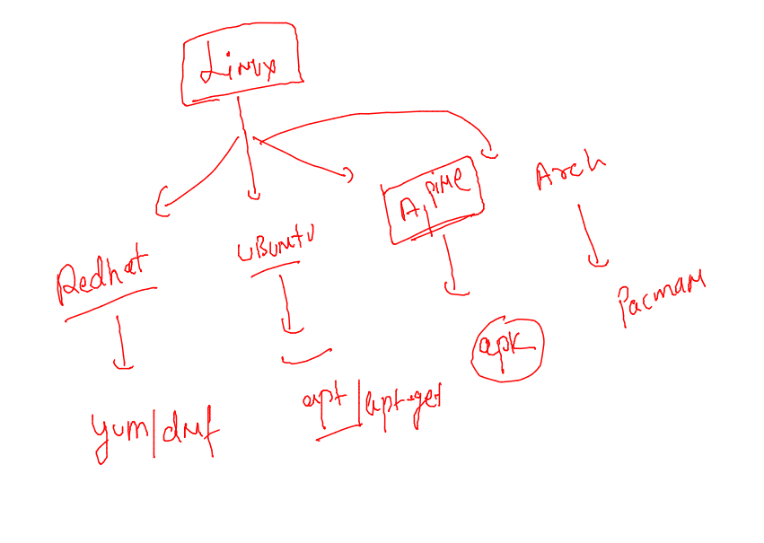

## training plan 


## python based docker image assignment 

### Dockerfile 

```
from alpine 
LABEL email=ashutoshh@linux.com 
RUN apk add python3 
RUN mkdir  /code 
ADD https://raw.githubusercontent.com/redashu/pythonLang/main/while.py /code/ 
# copy and add both are same but add support URL sources also 
ENTRYPOINT python3 /code/while.py 
# ENTrypoint is same as CMD 
```

### image build 

```
docker  build  -t ashualp:pycodev1 -f  alpine.dockerfile  . 

```

### creating container and checking logs 

```
220  docker run -itd --name ashutest1  ashualp:pycodev1 
  221  docker logs  ashutest1
```

### tips 

```
ashu@docker-client ~]$ docker  image  prune 
WARNING! This will remove all dangling images.
Are you sure you want to continue? [y/N] y
Deleted Images:
deleted: sha256:d35131a5ee79243d462185d9769ed2bee8bc10e7173e05714f2451bf90c88d19
deleted: sha256:a96db9163c19529b92443dbfa18b938c2a9db9d4dd1dc81a524a618e1986253f
deleted: sha256:a95e
```

### linux based distro and their software installer



### Default process


```
from alpine 
LABEL email=ashutoshh@linux.com 
RUN apk add python3 
RUN mkdir  /code 
ADD https://raw.githubusercontent.com/redashu/pythonLang/main/while.py /code/ 
COPY . /code/
# copy and add both are same but add support URL sources also 
WORKDIR /code 
# change working directory to this 
ENTrypoint ["python3"]
CMD ["while.py"]

# ENTrypoint is same as CMD 
```


