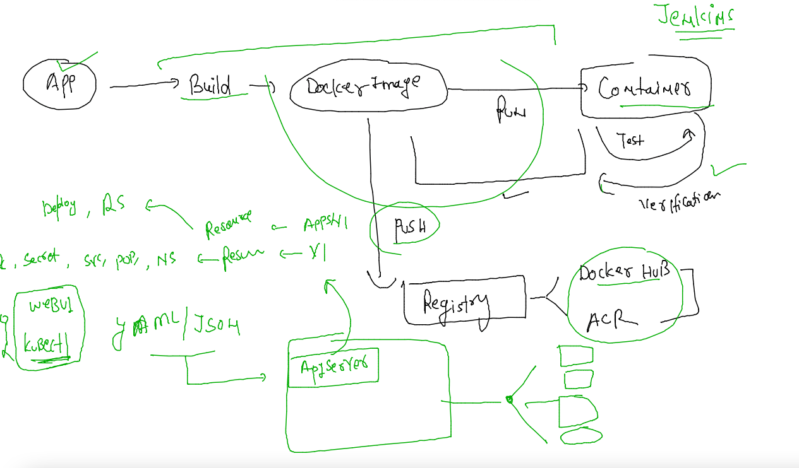
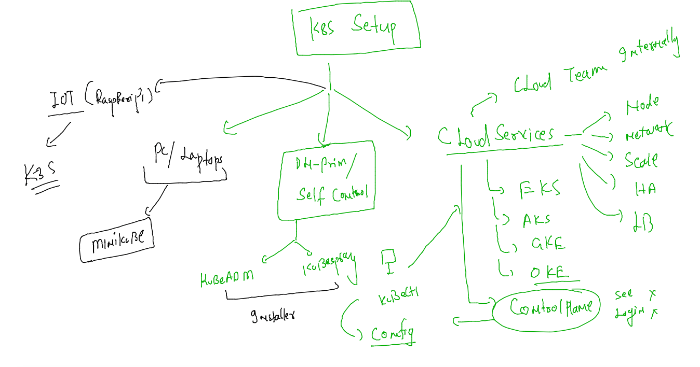
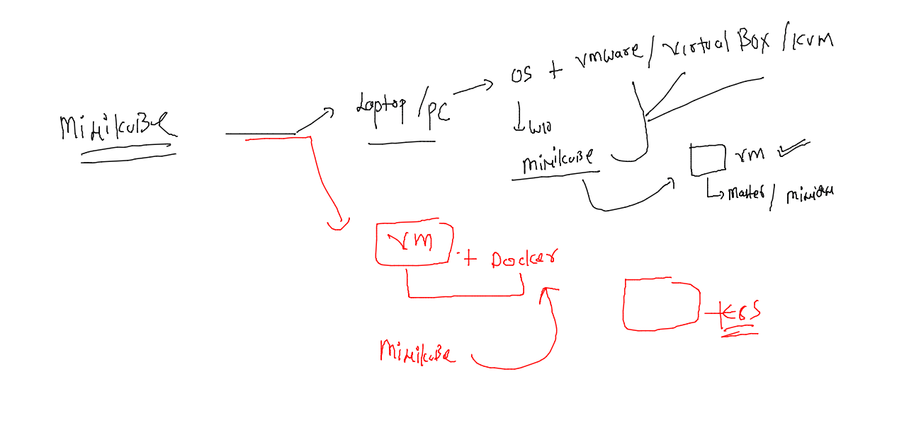
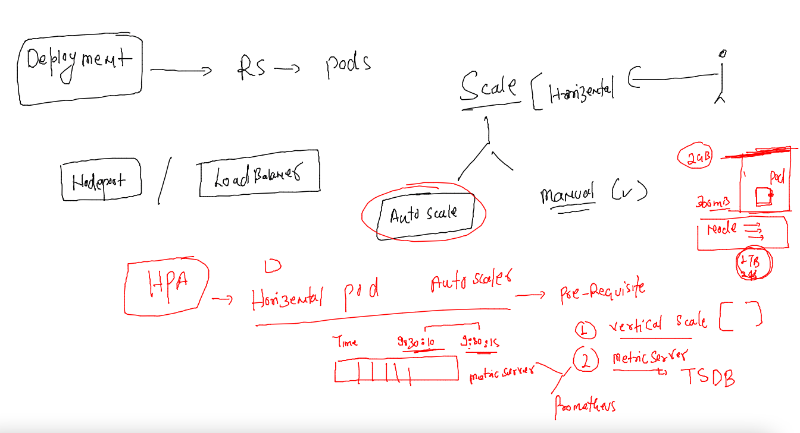

## training plan 


## Revision 



### Installation methods of k8s on various platforms 



### Minikube to deploy k8s setup 



### installing minikube 

```
 
[root@ip-172-31-91-143 ~]# curl -LO https://storage.googleapis.com/minikube/releases/latest/minikube-linux-amd64
  % Total    % Received % Xferd  Average Speed   Time    Time     Time  Current
                                 Dload  Upload   Total   Spent    Left  Speed
100 71.4M  100 71.4M    0     0   223M      0 --:--:-- --:--:-- --:--:--  224M
[root@ip-172-31-91-143 ~]# sudo install minikube-linux-amd64 /usr/local/bin/minikube
[root@ip-172-31-91-143 ~]# 
[root@ip-172-31-91-143 ~]# logout
[ec2-user@ip-172-31-91-143 ~]$ sudo -i
[root@ip-172-31-91-143 ~]# cp /usr/local/bin/minikube /usr/bin/
[root@ip-172-31-91-143 ~]# 
[root@ip-172-31-91-143 ~]# minikube version 
minikube version: v1.26.0
commit: f4b412861bb746be73053c9f6d2895f12cf78565
```

### add non root user to docker group 

```
usermod -aG docker  ec2-user

```

### deploy single node k8s cluster using minikube -- master / minion will be on the same node 

```
minikube start  --driver=docker 
😄  minikube v1.26.0 on Amazon 2
✨  Using the docker driver based on user configuration
📌  Using Docker driver with root privileges
👍  Starting control plane node minikube in cluster minikube
🚜  Pulling base image ...
💾  Downloading Kubernetes v1.24.1 preload ...
    > preloaded-images-k8s-v18-v1...: 405.83 MiB / 405.83 M
```

### setup client 

```
 curl -LO "https://dl.k8s.io/release/$(curl -L -s https://dl.k8s.io/release/stable.txt)/bin/linux/amd64/kubectl"
  % Total    % Received % Xferd  Average Speed   Time    Time     Time  Current
                                 Dload  Upload   Total   Spent    Left  Speed
100   154  100   154    0     0   3745      0 --:--:-- --:--:-- --:--:--  3756
100 43.5M  100 43.5M    0     0   167M      0 --:--:-- --:--:-- --:--:--  167M
[ec2-user@ip-172-31-91-143 ~]$ ls
kubectl
[ec2-user@ip-172-31-91-143 ~]$ sudo mv kubectl /usr/bin/
[ec2-user@ip-172-31-91-143 ~]$ sudo chmod +x /usr/bin/kubectl 
[ec2-user@ip-172-31-91-143 ~]$ 
[ec2-user@ip-172-31-91-143 ~]$ kubectl get nodes
NAME       STATUS   ROLES           AGE   VERSION
minikube   Ready    control-plane   64s   v1.24.1
[ec2-user@ip-172-31-91-143 ~]$ 


```
### Understanding auto scaling in k8s for apps 

### creating a deployment 

```
 kubectl create deployment  dogapp --image=dockerashu/dog:v1  --port 80 
 kubectl  get  deploy 
NAME     READY   UP-TO-DATE   AVAILABLE   AGE
dogapp   1/1     1            1           6s
```

### creating nodeport service 

```
 kubectl  expose deployment  dogapp  --type NodePort  --port 80 --name doglb1 
service/doglb1 exposed
[ashu@docker-client mobi-dockerimages]$ kubectl  get  svc 
NAME     TYPE       CLUSTER-IP      EXTERNAL-IP   PORT(S)        AGE
doglb1   NodePort   10.104.97.118   <none>        80:30473/TCP   5s
[ashu@docker-client mobi-dockerimages]$ 
```

### FOR horizental scaling we need HPA support 



### resource restriction for pod container 

```
apiVersion: apps/v1
kind: Deployment
metadata:
  creationTimestamp: null
  labels:
    app: dogapp
  name: dogapp
spec:
  replicas: 1
  selector:
    matchLabels:
      app: dogapp
  strategy: {}
  template: # info about pod 
    metadata:
      creationTimestamp: null
      labels: # label of pod 
        app: dogapp
    spec:
      containers:
      - image: dockerashu/dog:v1
        name: dog
        ports:
        - containerPort: 80
        resources: 
          requests: # resource info 
            cpu: 100m # 1 vcpu/ 1 core  == 1000 milicore 
            memory: 100M 
          limits:
            memory: 300M 
            cpu: 200m 

status: {}

```

### 

```
kubectl  apply -f  dogdeploy.yaml 
 1001  kubectl get po 
```

### HPA 

```
kubectl get deploy 
NAME     READY   UP-TO-DATE   AVAILABLE   AGE
dogapp   1/1     1            1           57m
[ashu@docker-client k8s-deploy-apps]$ kubectl get  hpa 
No resources found in ashu-project namespace.
[ashu@docker-client k8s-deploy-apps]$ kubectl autoscale deployment  dogapp  --min=3 --max=15 --cpu-percent=10 
horizontalpodautoscaler.autoscaling/dogapp autoscaled
[ashu@docker-client k8s-deploy-apps]$ kubectl  get  hpa
NAME     REFERENCE           TARGETS         MINPODS   MAXPODS   REPLICAS   AGE
dogapp   Deployment/dogapp   <unknown>/10%   3         15        0          4s
[ashu@docker-client k8s-deploy-apps]$ 

```

### check for minimum 

```
 kubectl get deploy 
NAME     READY   UP-TO-DATE   AVAILABLE   AGE
dogapp   3/3     3            3           60m
[ashu@docker-client k8s-deploy-apps]$ kubectl get po 
NAME                      READY   STATUS    RESTARTS   AGE
dogapp-79b6b89d95-96p8g   1/1     Running   0          38m
dogapp-79b6b89d95-htwt7   1/1     Running   0          79s
dogapp-79b6b89d95-rqm66   1/1     Running   0          79s
```

### dashboard in k8s 

```
kubectl apply -f https://raw.githubusercontent.com/kubernetes/dashboard/v2.5.0/aio/deploy/recommended.yaml
namespace/kubernetes-dashboard created
serviceaccount/kubernetes-dashboard created
service/kubernetes-dashboard created
secret/kubernetes-dashboard-certs created
secret/kubernetes-dashboard-csrf created
secret/kubernetes-dashboard-key-holder created
configmap/kubernetes-dashboard-settings created
role.rbac.authorization.k8s.io/kubernetes-dashboard created
clusterrole.rbac.authorization.k8s.io/kubernetes-dashboard unchanged
rolebinding.rbac.authorization.k8s.io/kubernetes-dashboard created
clusterrolebinding.rbac.authorization.k8s.io/kubernetes-dashboard unchanged
deployment.apps/kubernetes-dashboard created
service/dashboard-metrics-scraper created
```

### change service type 

```
 kubectl  get svc -n kubernetes-dashboard
NAME                        TYPE        CLUSTER-IP      EXTERNAL-IP   PORT(S)    AGE
dashboard-metrics-scraper   ClusterIP   10.111.119.40   <none>        8000/TCP   68s
kubernetes-dashboard        ClusterIP   10.97.77.77     <none>        443/TCP    68s
[ashu@docker-client k8s-deploy-apps]$ kubectl edit  svc   kubernetes-dashboard    -n kubernetes-dashboard
service/kubernetes-dashboard edited
[ashu@docker-client k8s-deploy-apps]$ kubectl  get svc -n kubernetes-dashboard
NAME                        TYPE        CLUSTER-IP      EXTERNAL-IP   PORT(S)         AGE
dashboard-metrics-scraper   ClusterIP   10.111.119.40   <none>        8000/TCP        2m52s
kubernetes-dashboard        NodePort    10.97.77.77     <none>        443:32078/TCP   2m52s
[ashu@docker-client k8s-deploy-apps]$ 
```

### from 1.24 onward there will be no secret created automatically for service account 

### creating secret 

```
apiVersion: v1
kind: Secret
type: kubernetes.io/service-account-token
metadata:
  name: dash-secret
  annotations:
    kubernetes.io/service-account.name: "kubernetes-dashboard"
  namespace: kubernetes-dashboard
```

### apply 

```
 kubectl apply -f dashboard-secret.yaml 
secret/dash-secret created
[ashu@docker-client k8s-deploy-apps]$ kubectl  get secret -n kubernetes-dashboard
NAME                              TYPE                                  DATA   AGE
dash-secret                       kubernetes.io/service-account-token   3      4s
kubernetes-dashboard-certs        Opaque                                0      12m
kubernetes-dashboard-csrf         Opaque                                1      12m
kubernetes-dashboard-key-holder   Opaque         
```

### to get the token of service account 

```
kubectl  describe  secret  dash-secret   -n kubernetes-dashboard
Name:         dash-secret
Namespace:    kubernetes-dashboard
Labels:       <none>
Annotations:  kubernetes.io/service-account.name: kubernetes-dashboard
              kubernetes.io/service-account.uid: 4c984e5b-6ca9-4e99-a870-fc81915b02ac

Type:  kubernetes.io/service-account-token

Data
====
namespace:  20 bytes
token:      eyJhbGciOiJSUzI1NiIsImtpZCI6IlJrRTFsSnY2aHJmUE53VlVHLVgxYXZqSVp2SldpcUJxaFJqenlMVTMyNUkifQ.eyJpc3MiOiJrdWJlcm5ldGVzL3NlcnZpY2VhY2NvdW50Iiwia3ViZXJuZXRlcy5pby9zZXJ2aWNlYWNjb3VudC9u
```


