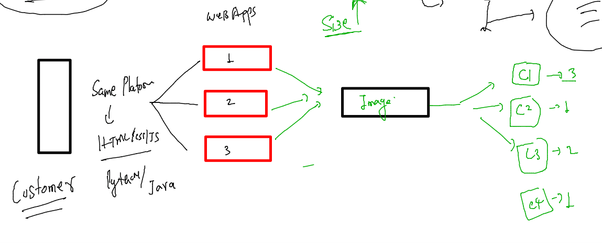
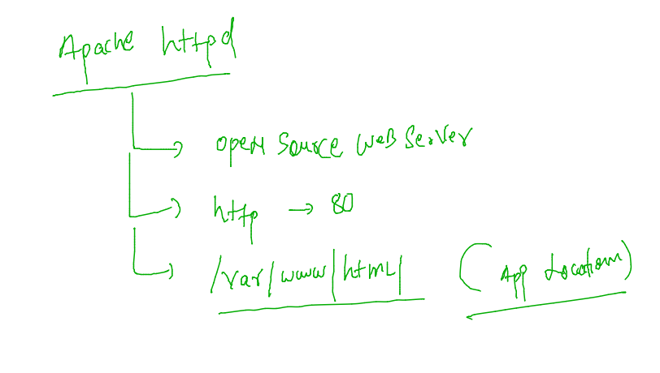
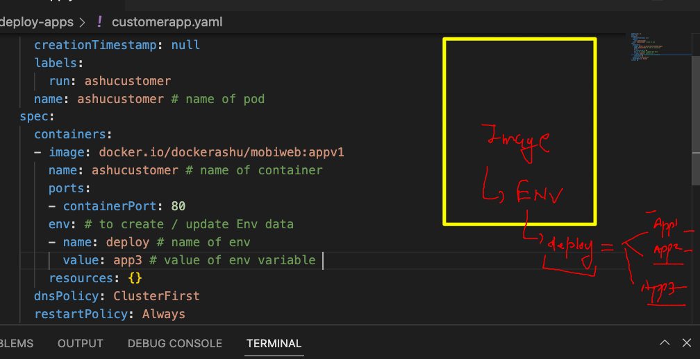
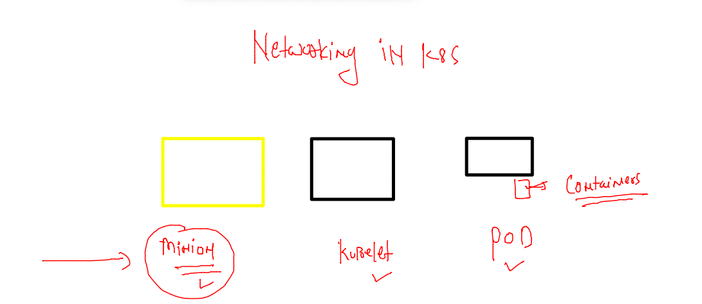
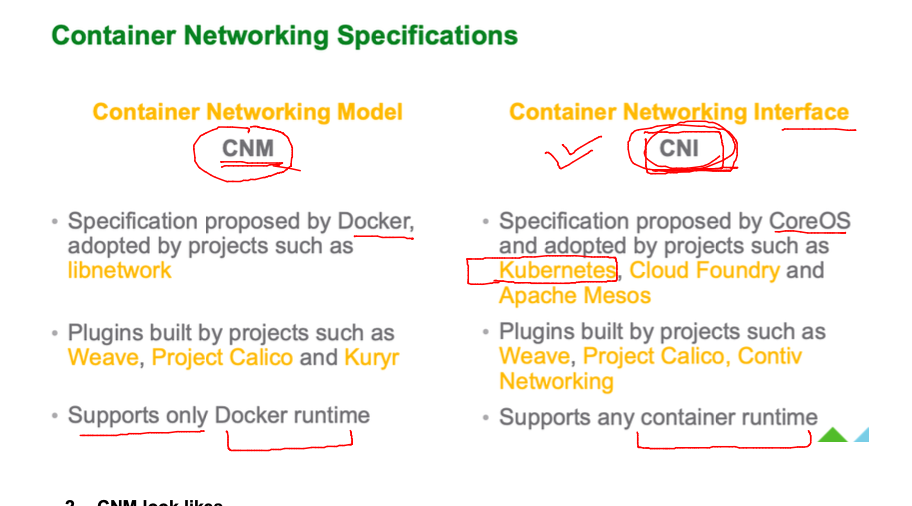
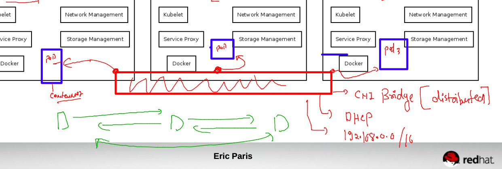
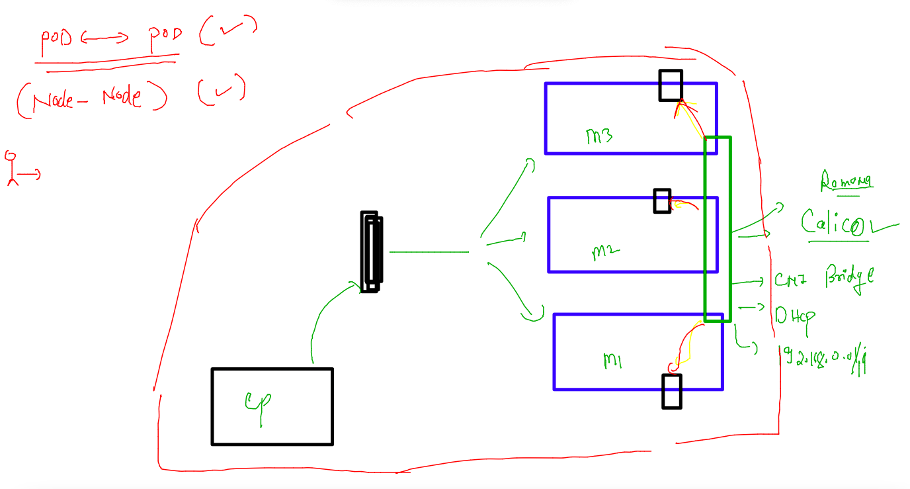
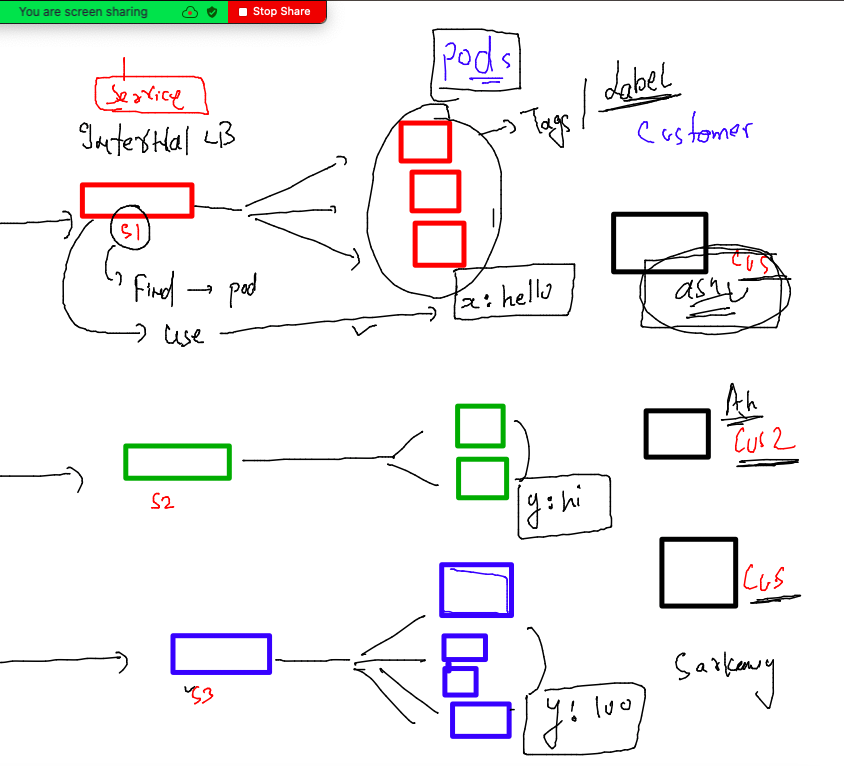
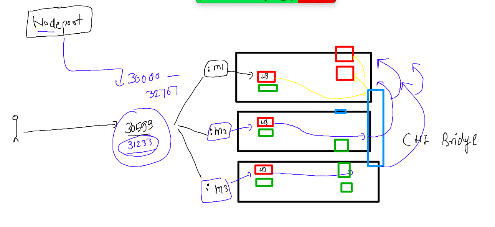

## training plan 


### Revision process of docker , kubernetes and CI 


### multi app container image 



### 3 sample html project 

```
 773  git clone https://github.com/microsoft/project-html-website.git
  774  ls
  775  git clone https://github.com/schoolofdevops/html-sample-app.git
  776  history 
  777  ls
  778  git clone https://github.com/yenchiah/project-website-template.git
  779  ls
```

### Dockerfile 

### info about apache httpd 



### pushing project to git repo 

```
812  git  add  .
  813  git commit -m "ashu customer app v1 "
  814  git config --global user.email "ashutoshh@linux.com"
  815  git config --global user.name  redashu
  816  git commit -m "ashu customer app v1 "
  817  history 
[ashu@docker-client mobi-ashuapp]$ git status 
On branch master
Your branch is ahead of 'origin/master' by 1 commit.
  (use "git push" to publish your local commits)

nothing to commit, working tree clean
[ashu@docker-client mobi-ashuapp]$ 
```

### pushing it 

```
git push 
Enumerating objects: 136, done.
Counting objects: 100% (136/136), done.
Delta compression using up to 2 threads
Compressing objects: 100% (131/131), done.
Writing objects: 100% (135/135), 2.64 MiB | 7.40 MiB/s, done.
Total 135 (delta 7), reused 0 (delta 0), pack-reused 0
remote: Resolving deltas: 100% (7/7), done.
To https://github.com/redashu/mobi-ashuapp.git
   ac3d15f..0d3c7ad  master -> master
```
### CI using jenkins 


### coming back to k8s pod 

### create pod from CLi 

```
kubectl  run  ashupod2 --image=nginx  --port 80 
pod/ashupod2 created
[ashu@docker-client k8s-deploy-apps]$ kubectl  get  po
NAME       READY   STATUS    RESTARTS   AGE
ashupod2   1/1     Running   0          6s
```

### auto generate YAML/Json file 

```
kubectl  run  ashupod2 --image=nginx  --port 80 --dry-run=client  -o yaml 
apiVersion: v1
kind: Pod
metadata:
  creationTimestamp: null
  labels:
    run: ashupod2
  name: ashupod2
spec:
  containers:
  - image: nginx
    name: ashupod2
    ports:
    - containerPort: 80
    resources: {}
  dnsPolicy: ClusterFirst
  restartPolicy: Always
status: {}
[ashu@docker-client k8s-deploy-apps]$ kubectl  run  ashupod2 --image=nginx  --port 80 --dry-run=client  -o yaml >autopod.yaml
```

### in JSON format also 

```
844  kubectl  run  ashupod2 --image=nginx  --port 80 --dry-run=client  -o json 
  845  kubectl  run  ashupod2 --image=nginx  --port 80 --dry-run=client  -o json >auto.json
```

### creating pod 

```
kubectl create -f  autopod.yaml 
pod/ashupod2 created
[ashu@docker-client k8s-deploy-apps]$ kubectl  get po
NAME          READY   STATUS             RESTARTS      AGE
ashupod2      1/1     Running            0             3s
```

### lets clean up 

```
kubectl delete -f  autopod.yaml 
pod "ashupod2" deleted
[ashu@docker-client k8s-deploy-apps]$ 
```

### deploy a docker hub based webapp in k8s as POD 

```
kubectl run  ashucustomer --image=docker.io/dockerashu/mobiweb:appv1 --port 80 --dry-run=client -o yaml >customerapp.yaml 
```

### ENV in YAML POD file 



### creating pod 

```
 kubectl create -f customerapp.yaml --dry-run=client 
pod/ashucustomer created (dry run)
[ashu@docker-client k8s-deploy-apps]$ kubectl create -f customerapp.yaml 
pod/ashucustomer created
[ashu@docker-client k8s-deploy-apps]$ kubectl  get  po 
NAME                READY   STATUS              RESTARTS   AGE
ashucustomer        0/1     ContainerCreating   0          3s
prasadpodcustomer   1/1     Running             0  
```

## Networking in k8s 



### Pod Networking will be maintained by CNI model 



### Pod can connect to each other by default 



### pod to pod / node to node is all set 



## Introduction to internal LB in k8s 


### service in k8s will be using labels of pods to find 



### checking label of pod 

```
 k get  po  ashucustomer  --show-labels
NAME           READY   STATUS    RESTARTS   AGE    LABELS
ashucustomer   1/1     Running   0          121m   run=ashucustomer
[ashu@docker-client ~]$ 

```

### creating service 

```
kubectl  create  service 
Create a service using a specified subcommand.

Aliases:
service, svc

Available Commands:
  clusterip      Create a ClusterIP service
  externalname   Create an ExternalName service
  loadbalancer   Create a LoadBalancer service
  nodeport       Create a NodePort service
```

### NodePort 

```
[ashu@docker-client k8s-deploy-apps]$ kubectl  create  service nodeport  ashulb1 --tcp 1234:80  --dry-run=client  -o yaml 
apiVersion: v1
kind: Service
metadata:
  creationTimestamp: null
  labels:
    app: ashulb1
  name: ashulb1
spec:
  ports:
  - name: 1234-80
    port: 1234
    protocol: TCP
    targetPort: 80
  selector:
    app: ashulb1
  type: NodePort
status:
  loadBalancer: {}
```

### deploy internal LB 

```
[ashu@docker-client k8s-deploy-apps]$ kubectl  create -f  nodeport1.yaml 
service/ashulb1 created
[ashu@docker-client k8s-deploy-apps]$ kubectl  get  service 
NAME         TYPE        CLUSTER-IP       EXTERNAL-IP   PORT(S)          AGE
abhilb1      NodePort    10.111.59.78     <none>        1122:30571/TCP   1s
ashulb1      NodePort    10.111.198.104   <none>        1234:30599/TCP   6s
kubernetes   ClusterIP   10.96.0.1        <none>        443/TCP          33h
ljubalb1     NodePort    10.99.128.169    <none>        1001:30641/TCP   5s
makeshlb1    NodePort    10.108.125.211   <none>        1234:31884/TCP   2s
yasminlb1    NodePort    10.98.208.111    <none>        2134:32742/TCP   1s
```

### NodePort explained 



### checking pod labels 

```
 k get po ashucustomer  --show-labels
NAME           READY   STATUS    RESTARTS   AGE    LABELS
ashucustomer   1/1     Running   0          149m   run=ashucustomer
[ashu@docker-client k8s-deploy-apps]$ 
```

### update service selector field 

```
apiVersion: v1
kind: Service
metadata:
  creationTimestamp: null
  labels:
    app: ashulb1
  name: ashulb1
spec:
  ports:
  - name: 1234-80
    port: 1234
    protocol: TCP
    targetPort: 80
  selector: # Pod finder using label 
    run: ashucustomer 
  type: NodePort
status:
  loadBalancer: {}

```

### recreate service 

```
kubectl replace -f nodeport1.yaml  --force
service "ashulb1" deleted
service/ashulb1 replaced
[ashu@docker-client k8s-deploy-apps]$ k get svc ashulb1  -o wide
NAME      TYPE       CLUSTER-IP    EXTERNAL-IP   PORT(S)          AGE   SELECTOR
ashulb1   NodePort   10.99.27.56   <none>        1234:30067/TCP   6s    run=ashucustomer
```

### namespace in k8s 

```

[ashu@docker-client ~]$ kubectl  create  namespace   ashu-project  --dry-run=client -o yaml 
apiVersion: v1
kind: Namespace
metadata:
  creationTimestamp: null
  name: ashu-project
spec: {}
status: {}
[ashu@docker-client ~]$ kubectl  create  namespace   ashu-project
namespace/ashu-project created
[ashu@docker-client ~]$ kubectl get ns
NAME                   STATUS   AGE
ashu-project           Active   3s
default                Active   34h
kube-node-lease        Active   34h
kube-public            Active   34h
kube-system            Active   34h
kubernetes-dashboard   Active   34h
[ashu@docker-client ~]$ kubectl config set-context  --current --namespace ashu-project 
Context "kubernetes-admin@kubernetes" modified.
[ashu@docker-client ~]$ kubectl get po
No resources found in ashu-project namespace.
[ashu@docker-client ~]$ 

```

### checking current namespace 

```
kubectl  config get-contexts 
CURRENT   NAME                          CLUSTER      AUTHINFO           NAMESPACE
*         kubernetes-admin@kubernetes   kubernetes   kubernetes-admin   ashu-project
```


