## training plan 


## COntainer  networking -- 

### two container networking models are there 

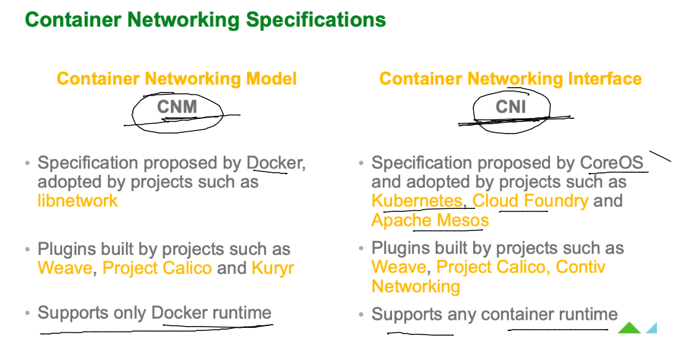

### lets start with CNM (Container networking model ) by Docker 

### docker host are having 3 bridges  

```
docker  network  ls
NETWORK ID     NAME      DRIVER    SCOPE
feb56cc9d6db   bridge    bridge    local
614a93e30fc4   host      host      local
ef13a374ff97   none      null      local
```

### on Docker server  default bridge is present by the name of docker0 

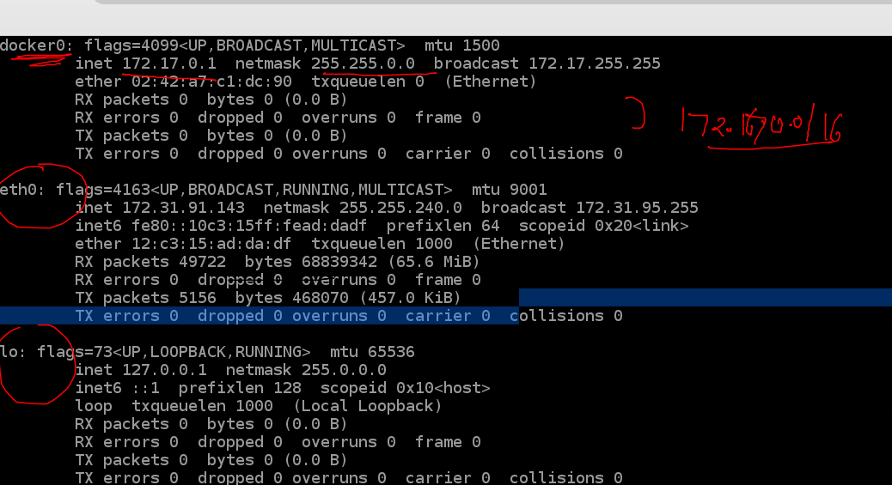

```
l
[ashu@docker-client mobi-dockerimages]$ docker  network   inspect bridge
[
    {
        "Name": "bridge",
        "Id": "feb56cc9d6db9e4b50a6a314fb1ddcbcd2035ea3cc86eb07878f8cc28ea87b45",
        "Created": "2022-06-17T07:29:06.288703482Z",
        "Scope": "local",
        "Driver": "bridge",
        "EnableIPv6": false,
        "IPAM": {
            "Driver": "default",
            "Options": null,
            "Config": [
                {
                    "Subnet": "172.17.0.0/16",
                    "Gateway": "172.17.0.1"
                }
            ]
        },
        "Internal": false,
        "Attachable": false,
        "Ingress": false,
        "ConfigFrom": {
            "Network": ""
```


### creating container and check interfaces 

```
docker  run -itd --name ashuc1  alpine ping fb.com 
2ecffaf971cc5581462e4f7b8cb74d191498a070d1bcf01c33a2b546e3e64f56
[ashu@docker-client mobi-dockerimages]$ docker  ps
CONTAINER ID   IMAGE     COMMAND         CREATED          STATUS          PORTS     NAMES
2ecffaf971cc   alpine    "ping fb.com"   27 seconds ago   Up 27 seconds             ashuc1
[ashu@docker-client mobi-dockerimages]$ 

```

### checking interfaces on docker bridge 

```
docker  network  inspect  bridge 
[
    {
        "Name": "bridge",
        "Id": "feb56cc9d6db9e4b50a6a314fb1ddcbcd2035ea3cc86eb07878f8cc28ea87b45",
        "Created": "2022-06-17T07:29:06.288703482Z",
        "Scope": "local",
        "Driver": "bridge",
        "EnableIPv6": false,
        "IPAM": {
            "Driver": "default",
            "Options": null,
            "Config": [
                {
                    "Subnet": "172.17.0.0/16",
                    "Gateway": "172.17.0.1"
                }
            ]
        },
        "Internal": false,
        "Attachable": false,
        "Ingress": false,
        "ConfigFrom": {
            "Network": ""
        },
        "ConfigOnly": false,
        "Containers": {
            "2ecffaf971cc5581462e4f7b8cb74d191498a070d1bcf01c33a2b546e3e64f56": {
                "Name": "ashuc1",
                "EndpointID": "e9fb7ad90b316d11cf94fae6cc9598ee68d3593eb221eb2767d00bc13f564dee",
                "MacAddress": "02:42:ac:11:00:02",
                "IPv4Address": "172.17.0.2/16",
                "IPv6Address": ""
            },
            "57c61ca7ffe3841fb851ac5519acdf2a4bf2f18ee01899359d19b42343d3023e": {
                "Name": "kostas1",
                "EndpointID": "f06e3b74cbb851222771c956981118b6029ff5de320839380338b8f972bf5053",
                "MacAddress": "02:42:ac:11:00:04",
                "IPv4Address": "172.17.0.4/16",
                "IPv6Address": ""
            },
            "5cb5ca12b03a2749d345d41f90c2dd07151699578f1350dd5822162b5852845e": {
                "Name": "calin1",
                "EndpointID": "8f6e1f320ba149407a66bdbc3830e1db3d0b375da3da713cdfff76474e5135c7",
                "MacAddress": "02:42:ac:11:00:0f",
                "IPv4Address": "172.17.0.15/16",
                "IPv6Address": ""
            },
            "6cd60aa05838c30ae4a709395fca65c82ce81d9fa4a48af7298c3d9ab9f14604": {
                "Name": "jjjava",
                "EndpointID": "c73aeaaf0c0b13603dac489a264230b0a6802a81e1a8bcf76828f77e8e02a63d",
                "MacAddress": "02:42:ac:11:00:0d",
                "IPv4Address": "172.17.0.13/16",
                "IPv6Address": ""
            },
            "77947f793f462728e92b6438781d962927537106ebc2a135a577ba4a736dd78f": {
                "Name": "sarkany-c1",
                "EndpointID": "1000f4d1816fdaa93a220cbc60e6fdbfac7bfa032ffc8cdd1a2992a5be361556",
                "MacAddress": "02:42:ac:11:00:0e",
                "IPv4Address": "172.17.0.14/16",
                "IPv6Address": ""
            },
            "8b80f8cb5461f104d750007a41fd1bbb2abf7d3f3837be24ab2e4eec0377a76e": {
                "Name": "fernandesalpc5",
                "EndpointID": "c6bcd1b9fa6cef7b1b0217327ba80c704c3130594d168597089b4c8fb8a70c61",
                "MacAddress": "02:42:ac:11:00:11",
                "IPv4Address": "172.17.0.17/16",
                "IPv6Address": ""
            },
            "95f0ade67a3b99e9dcbd31c715070b76310d4df3fc92ce3a07659261f88bfe62": {
                "Name": "rachmanc1",
                "EndpointID": "19e7dc712ad3d5dc6885680b8c0b389f3d7cc7d6f305f6af8f06842be5f750fd",
                "MacAddress": "02:42:ac:11:00:03",
                "IPv4Address": "172.17.0.3/16",
                "IPv6Address": ""
            },
            "a405e292e80af59337be04538f76776c12cf14f776d1411e222fe0553cf84ac5": {
                "Name": "somanathC2",
                "EndpointID": "c3765e6db078371a31064a02e027c862e57694bd78955dc3ef9074066822089b",
                "MacAddress": "02:42:ac:11:00:0b",
                "IPv4Address": "172.17.0.11/16",
                "IPv6Address": ""
            },
            "aec00f1288cb94e30dd0064e65d391ae03c91a0ce244b26a2aa658c2ba24e78d": {
                "Name": "ravik",
                "EndpointID": "9c0822b6350f0628e17425c0dd94dfada31cc0cdaec142cd1036c1ba6c00337c",
                "MacAddress": "02:42:ac:11:00:07",
                "IPv4Address": "172.17.0.7/16",
                "IPv6Address": ""
            },
            "c8bd1283859bad83724392c6ab558c7d93debddd67e780cf6579bd83f07dc67f": {
                "Name": "mark1",
                "EndpointID": "db37a05af22d5fb8dfae2ecbdcf69f200161efdb8a55f3e98ceccd4f5cfc049b",
                "MacAddress": "02:42:ac:11:00:08",
                "IPv4Address": "172.17.0.8/16",
                "IPv6Address": ""
            },
            "db7dd080d06b1c1fc9172967b2cee02a498f6ef3c8fcbb0d44e20d02a8313514": {
                "Name": "peterc1",

```


### we can check on server side as well because docker is using linux bridge networking 

```
brctl show
bridge name	bridge id		STP enabled	interfaces
docker0		8000.0242a7c1dc90	no		veth0046416
							veth1b3eec7
							veth31a2362
							veth32d07e3
							veth3d97660
							veth46500bb
					
```

### container can connect to each others 

```
docker  exec -it ashuc1  sh 
/ # ifconfig 
eth0      Link encap:Ethernet  HWaddr 02:42:AC:11:00:02  
          inet addr:172.17.0.2  Bcast:172.17.255.255  Mask:255.255.0.0
          UP BROADCAST RUNNING MULTICAST  MTU:1500  Metric:1
          RX packets:417 errors:0 dropped:0 overruns:0 frame:0
          TX packets:389 errors:0 dropped:0 overruns:0 carrier:0
          collisions:0 txqueuelen:0 
          RX bytes:38878 (37.9 KiB)  TX bytes:36770 (35.9 KiB)

lo        Link encap:Local Loopback  
          inet addr:127.0.0.1  Mask:255.0.0.0
          UP LOOPBACK RUNNING  MTU:65536  Metric:1
          RX packets:0 errors:0 dropped:0 overruns:0 frame:0
          TX packets:0 errors:0 dropped:0 overruns:0 carrier:0
          collisions:0 txqueuelen:1000 
          RX bytes:0 (0.0 B)  TX bytes:0 (0.0 B)

/ # ping  172.17.0.4
PING 172.17.0.4 (172.17.0.4): 56 data bytes
64 bytes from 172.17.0.4: seq=0 ttl=64 time=0.214 ms
64 bytes from 172.17.0.4: seq=1 ttl=64 time=0.074 ms
^C
--- 172.17.0.4 ping statistics ---
2 packets transmitted, 2 packets received, 0% packet loss
round-trip min/avg/max = 0.074/0.144/0.214 ms
/ # ping  172.17.0.15
PING 172.17.0.15 (172.17.0.15): 56 data bytes
64 bytes from 172.17.0.15: seq=0 ttl=64 time=0.2
```

### NAT is default configuration 

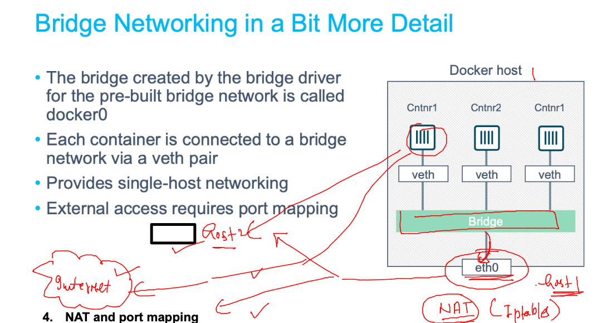

###

```
docker  exec -it ashuc1  sh 
/ # ping  172.31.95.235
PING 172.31.95.235 (172.31.95.235): 56 data bytes
^C
--- 172.31.95.235 ping statistics ---
4 packets transmitted, 0 packets received, 100% packet loss
/ # ping  www.google.com 
PING www.google.com (172.253.115.99): 56 data bytes
64 bytes from 172.253.115.99: seq=0 ttl=49 time=1.757 ms
64 bytes from 172.253.115.99: seq=1 ttl=49 time=1.793 ms
64 bytes from 172.253.115.99: seq=2 ttl=49 time=1.845 ms
^C
--- www.google.com ping statistics ---
3 packets transmitted, 3 packets received, 0% packet loss
round-trip min/avg/max = 1.757/1.798/1.845 ms
/ # exit
[ashu@docker-client ~]$ 

```

### port forwarding 

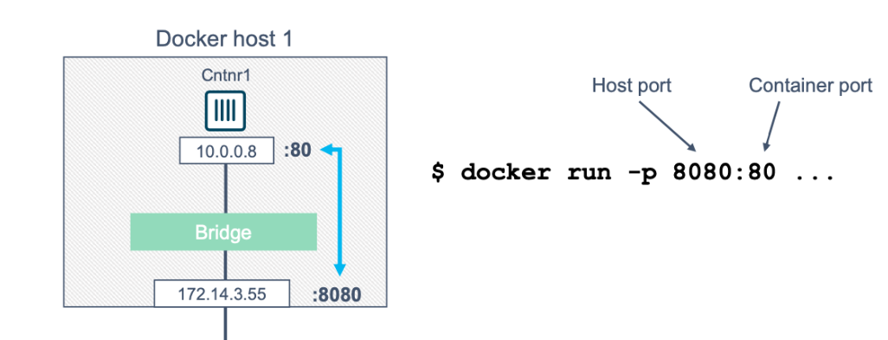

###

```
docker run -d --name ashuwebc1  -p  1235:80  nginx 
Unable to find image 'nginx:latest' locally
latest: Pulling from library/nginx
42c077c10790: Already exists 
62c70f376f6a: Pull complete 
915cc9bd79c2: Pull complete 
75a963e94de0: Pull complete 
7b1fab684d70: Pull complete 
db24d06d5af4: Pull complete 
Digest: sha256:2bcabc23b45489fb0885d69a06ba1d648aeda973fae7bb981bafbb884165e514
Status: Downloaded newer image for nginx:latest
b0452373b1e689d233949d4e7d655292e990a42c8becb5710bebd60ecf20883b
[ashu@docker-client mobi-dockerimages]$ docker ps
CONTAINER ID   IMAGE     COMMAND                  CREATED          STATUS          PORTS                                   NAMES
f4de25d55bd6   nginx     "/docker-entrypoint.…"   3 seconds ago    Up 1 second     0.0.0.0:1502->80/tcp, :::1502->80/tcp   istvan-c1
6fef17ecc4bc   nginx     "/docker-entrypoint.…"   13 seconds ago   Up 12 seconds   0.0.0.0:1429->80/tcp, :::1429->80/tcp   rachmanwebc1
b0452373b1e6   nginx     "/docker-entrypoint.…"   32 seconds ago   Up 30 seconds   0.0.0.0:1235->80/tcp, :::1235->80/tcp   ashuwebc1
```

### container without any network 

```
ef13a374ff97   none      null      local
[ashu@docker-client ~]$ 
[ashu@docker-client ~]$ 
[ashu@docker-client ~]$ 
[ashu@docker-client ~]$ docker  run -it --rm  --network none  alpine 
/ # ping google.com 
ping: bad address 'google.com'
/ # ping 172.17.0.1
PING 172.17.0.1 (172.17.0.1): 56 data bytes
ping: sendto: Network unreachable
/ # ifconfig 
lo        Link encap:Local Loopback  
          inet addr:127.0.0.1  Mask:255.0.0.0
          UP LOOPBACK RUNNING  MTU:65536  Metric:1
          RX packets:0 errors:0 dropped:0 overruns:0 frame:0
          TX packets:0 errors:0 dropped:0 overruns:0 carrier:0
          collisions:0 txqueuelen:1000 
          RX bytes:0 (0.0 B)  TX bytes:0 (0.0 B)

/ # exit

```

### problem with default docker bridge 

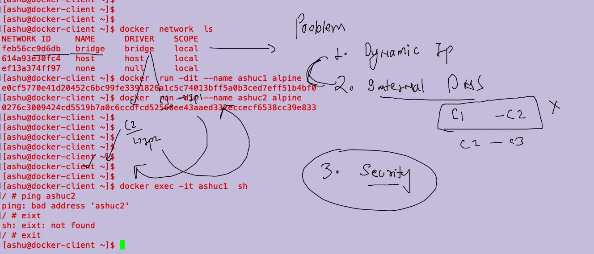

### creating custom bridge 

```
docker  network create  ashubr1
a7d8adcfc19fa7b3891b971634a96bca5f25069f872b35e2448047c47e39a7c0
[ashu@docker-client ~]$ docker  network ls
NETWORK ID     NAME      DRIVER    SCOPE
a7d8adcfc19f   ashubr1   bridge    local
feb56cc9d6db   bridge    bridge    local
614a93e30fc4   host      host      local
ef13a374ff97   none      null      local
[ashu@docker-client ~]$ docker  network inspect  ashubr1
[
    {
        "Name": "ashubr1",
        "Id": "a7d8adcfc19fa7b3891b971634a96bca5f25069f872b35e2448047c47e39a7c0",
        "Created": "2022-06-17T09:07:50.096097609Z",
        "Scope": "local",
        "Driver": "bridge",
        "EnableIPv6": false,
        "IPAM": {
            "Driver": "default",
            "Options": {},
            "Config": [
                {
                    "Subnet": "172.19.0.0/16",
                    "Gateway": "172.19.0.1"

```

### choose 

```
docker  network create  ashubr2  --subnet  192.168.100.0/24  --gateway 192.168.100.1 
dcf240b7d99b93deae4d704c353930ee12ae2c918886d036ecc192c2fa49bcac
[ashu@docker-client ~]$ docker  network ls
NETWORK ID     NAME      DRIVER    SCOPE
a7d8adcfc19f   ashubr1   bridge    local
dcf240b7d99b   ashubr2   bridge    local
```

### testing container access by name 

```
 docker  run -dit --name ashuc3  --network ashubr1  alpine
210c47780e6eb1df00ead387b873651029a38a22f304cc4e3edb146130edd1b6
[ashu@docker-client ~]$ docker  run -dit --name ashuc4  --network ashubr1  alpine
18ff48075193959747212ab7279497e088858d13da4ba93d449c38b98889aec6
[ashu@docker-client ~]$ docker exec -it ashuc3  sh 
/ # ping ashuc4
PING ashuc4 (172.19.0.3): 56 data bytes
64 bytes from 172.19.0.3: seq=0 ttl=64 time=0.082 ms
64 bytes from 172.19.0.3: seq=1 ttl=64 time=0.080 ms
^C
--- ashuc4 ping statistics ---
2 packets transmitted, 2 packets received, 0% packet loss
round-trip min/avg/max = 0.080/0.081/0.082 ms
/ # exit

```

### static ip to container 

```
docker  run -dit --name ashuc5  --network ashubr2  alpine
53c2ec457db8378d757779a64470205e62647a5db4a1a40ed6b8c2636061a592
[ashu@docker-client ~]$ docker  run -dit --name ashuc6 --ip 192.168.100.20  --network ashubr2  alpine
66aa0aa910e21f2a2fb5ba362964de9f803fcc6b8830cf6b056ff6db2f15eb6e
[ashu@docker-client ~]$ docker exec -it ashuc5  sh 
/ # ping ashuc6
PING ashuc6 (192.168.100.20): 56 data bytes
64 bytes from 192.168.100.20: seq=0 ttl=64 time=0.057 ms
64 bytes from 192.168.100.20: seq=1 ttl=64 time=0.081 ms
^C
--- ashuc6 ping statistics ---
2 packets transmitted, 2 packets received, 0% packet loss
round-trip min/avg/max = 0.057/0.069/0.081 ms
/ # exit

```


### Docker bridge networking drivers 

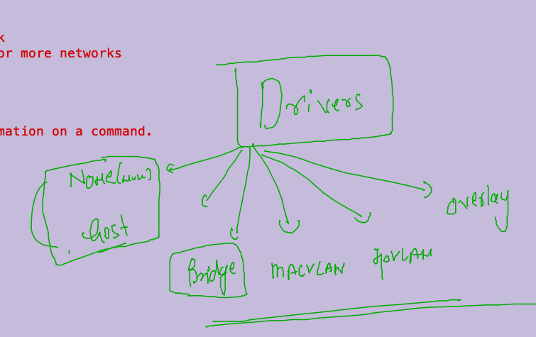

### MACvlan 

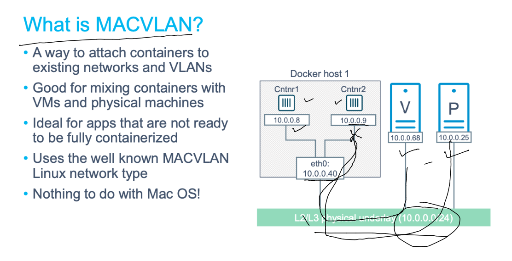

```
docker  network create  ashubr007  --subnet  192.168.1.0/24  --gateway 192.168.1.254  --driver macvlan -o parent=ens33  
```

### Note: macvlan understand  trunk protocol also 


## IPvlan bridge drivers 

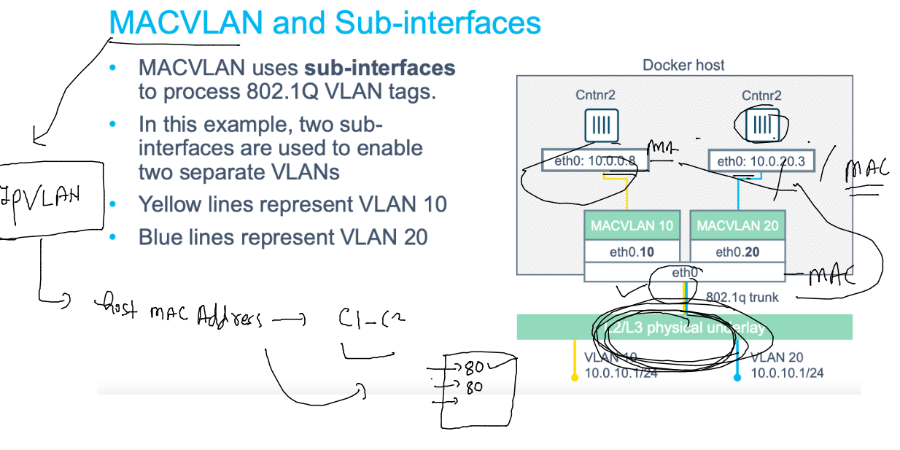


## Storage in Docker 

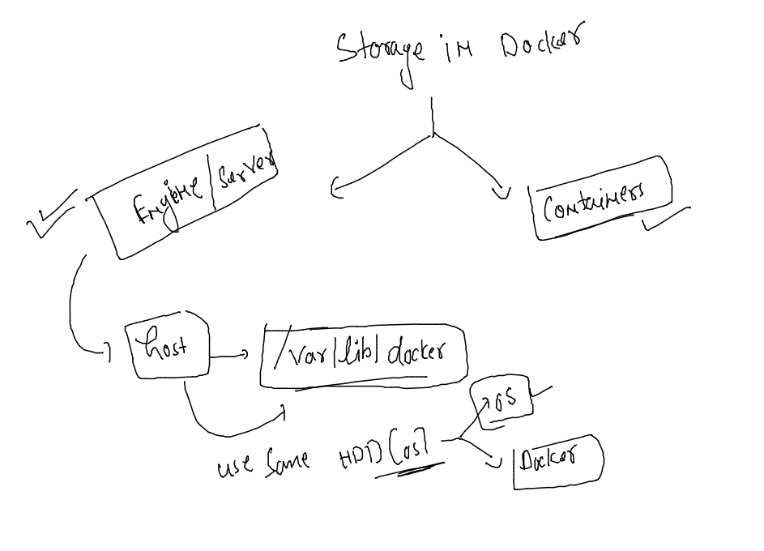

### your storage team will be doing this for you on docker server side 

```
[root@ip-172-31-91-143 ~]# lsblk 
NAME          MAJ:MIN RM  SIZE RO TYPE MOUNTPOINT
nvme0n1       259:0    0  100G  0 disk 
|-nvme0n1p1   259:1    0  100G  0 part /
`-nvme0n1p128 259:2    0    1M  0 part 
[root@ip-172-31-91-143 ~]# lsblk 
NAME          MAJ:MIN RM  SIZE RO TYPE MOUNTPOINT
nvme0n1       259:0    0  100G  0 disk 
|-nvme0n1p1   259:1    0  100G  0 part /
`-nvme0n1p128 259:2    0    1M  0 part 
nvme1n1       259:3    0  500G  0 disk 
[root@ip-172-31-91-143 ~]# mkfs.xfs   /dev/nvme1n1
meta-data=/dev/nvme1n1           isize=512    agcount=16, agsize=8192000 blks
         =                       sectsz=512   attr=2, projid32bit=1
         =                       crc=1        finobt=1, sparse=0
data     =                       bsize=4096   blocks=131072000, imaxpct=25
         =                       sunit=1      swidth=1 blks
naming   =version 2              bsize=4096   ascii-ci=0 ftype=1
log      =internal log           bsize=4096   blocks=64000, version=2
         =                       sectsz=512   sunit=1 blks, lazy-count=1
realtime =none                   extsz=4096   blocks=0, rtextents=0
[root@ip-172-31-91-143 ~]# mkdir /opt/docker
[root@ip-172-31-91-143 ~]# mount  /dev/nvme1n1  /opt/docker/
[root@ip-172-31-91-143 ~]# vim /etc/fstab 
[root@ip-172-31-91-143 ~]# mount -a
```

### Docker engineering will do only this 

```
cat  /etc/sysconfig/docker
# The max number of open files for the daemon itself, and all
# running containers.  The default value of 1048576 mirrors the value
# used by the systemd service unit.
DAEMON_MAXFILES=1048576

# Additional startup options for the Docker daemon, for example:
# OPTIONS="--ip-forward=true --iptables=true"
# By default we limit the number of open files per container
OPTIONS="--default-ulimit nofile=32768:65536 -H tcp://0.0.0.0:2375 -g /opt/docker"

# How many seconds the sysvinit script waits for the pidfile to appear
# when starting the daemon.
DAEMON_PIDFILE_TIMEOUT=10
[root@ip-172-31-91-143 ~]# systemctl daemon-reload 
[root@ip-172-31-91-143 ~]# systemctl restart docker 


```

### sync previous data to new locaiton 

```
 rsync -arpv /var/lib/docker/ /opt/docker/
 systemctl restart docker

```

### container storage --

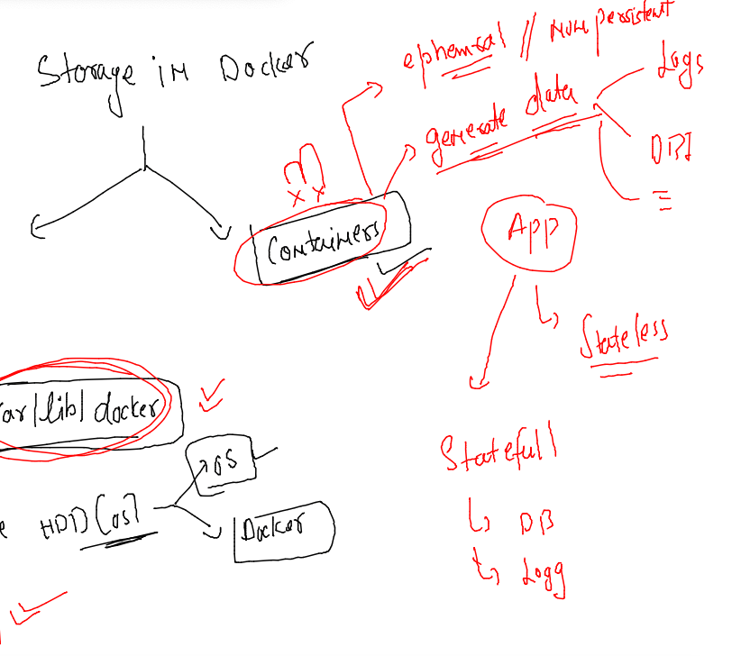

## creating mysql container

```
 docker  run -d  --name ashudb1  -e MYSQL_ROOT_PASSWORD="123456#" mysql 
Unable to find image 'mysql:latest' locally
latest: Pulling from library/mysql
c1ad9731b2c7: Pull complete 
54f6eb0ee84d: Pull complete 
cffcf8691bc5: Pull complete 
89a783b5ac8a: Pull complete 
6a8393c7be5f: Pull complete 
af768d0b181e: Pull complete 
810d6aaaf54a: Pull complete 
2e014a8ae4c9: Pull complete 
a821425a3341: Pull complete 
3a10c2652132: Pull complete 
4419638feac4: Pull complete 
681aeed97dfe: Pull complete 
Digest: sha256:548da4c67fd8a71908f17c308b8ddb098acf5191d3d7694e56801c6a8b2072cc
Status: Downloaded newer image for mysql:latest
6de7ee2589b4145828213192ca7400468301f634b2e5c452a311d990cf364668
[ashu@docker-client mobi-dockerimages]$ docker  ps
CONTAINER ID   IMAGE     COMMAND                  CREATED         STATUS         PORTS                 NAMES
6de7ee2589b4   mysql     "docker-entrypoint.s…"   4 seconds ago   Up 2 seconds   3306/tcp, 33060/tcp   ashudb1
```

### lets connect to db server

```
docker  exec -it  ashudb1  bash 
root@6de7ee2589b4:/# 
root@6de7ee2589b4:/# 
root@6de7ee2589b4:/# cat  /etc/os-release 
PRETTY_NAME="Debian GNU/Linux 10 (buster)"
NAME="Debian GNU/Linux"
VERSION_ID="10"
VERSION="10 (buster)"
VERSION_CODENAME=buster
ID=debian
HOME_URL="https://www.debian.org/"
SUPPORT_URL="https://www.debian.org/support"
BUG_REPORT_URL="https://bugs.debian.org/"
root@6de7ee2589b4:/# mysql  -u root -p
Enter password: 
Welcome to the MySQL monitor.  Commands end with ; or \g.
Your MySQL connection id is 8
Server version: 8.0.29 MySQL Community Server - GPL

Copyright (c) 2000, 2022, Oracle and/or its affiliates.

Oracle is a registered trademark of Oracle Corporation and/or its
affiliates. Other names may be trademarks of their respective
owners.

Type 'help;' or '\h' for help. Type '\c' to clear the current input statement.

mysql> 
```

### created one database 

```
mysql> create database  ashumobi;
Query OK, 1 row affected (0.01 sec)

mysql> show databases;
+--------------------+
| Database           |
+--------------------+
| ashumobi           |
| information_schema |
| mysql              |
| performance_schema |
| sys                |
+--------------------+
5 rows in set (0.00 sec)

```

### Docker volume to solve problem 

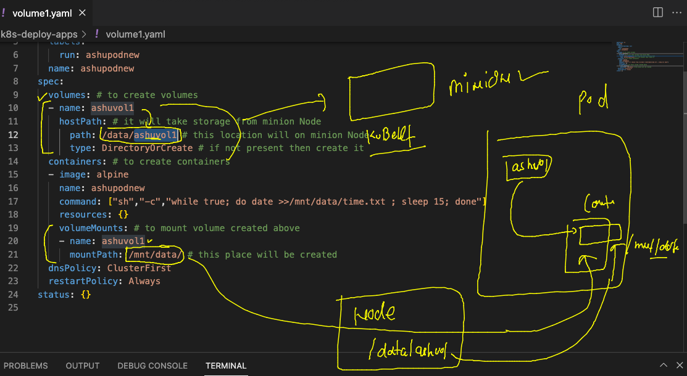


