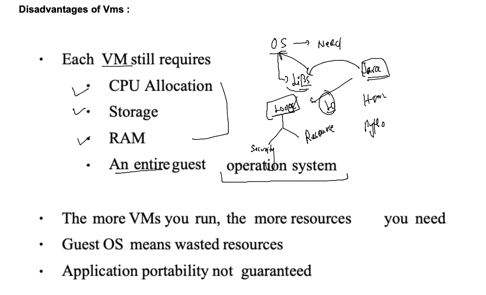
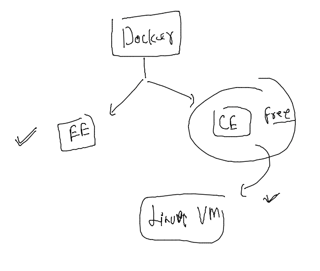
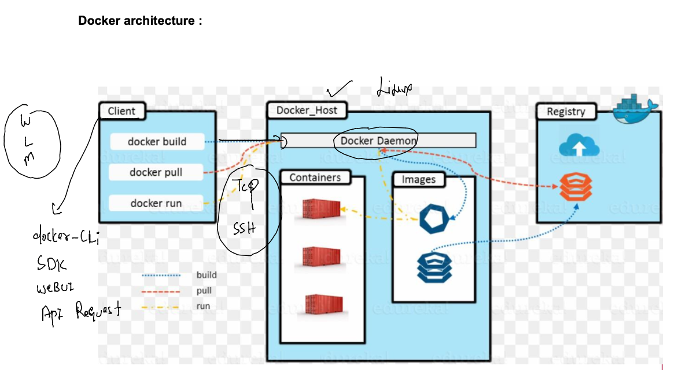
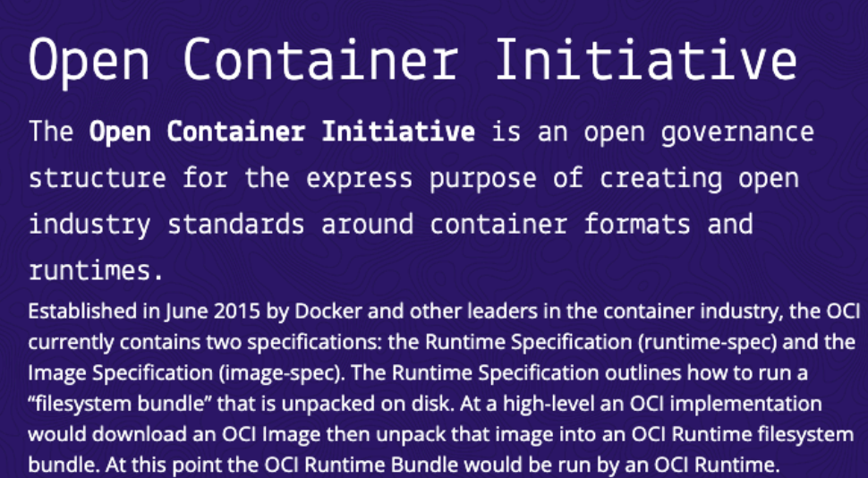
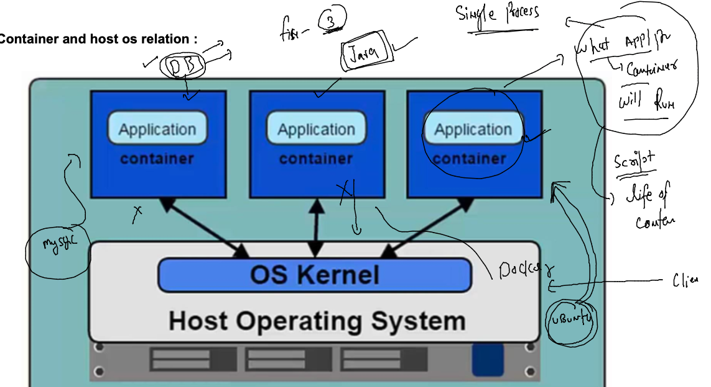

## training plan 


### labs 


### shortnames and other things 


### understanding problem in deploy /setup apps in bare-metal / hardware 


### wastage of resources 


### bare-metal -- to Hypervisor -- {virtualization}---vm


### down side of using VM 



### Understanding Os components 


## Introduction to containers 


### VM vs Continers 


### containers in more details 


### Introduction to container runtimes -- intro to Docker 


### Docker ce installation on Linux VM -- aws cloud 



### Docker architecture 



### connect docker client with your cred -- using ssh 

```
ssh  ashu@34.199.167.179
```

### docker client installed ??

```
docker  version 
Client:
 Version:           20.10.13
 API version:       1.41
 Go version:        go1.16.15
 Git commit:        a224086
 Built:             Thu Mar 31 19:20:32 2022
 OS/Arch:           linux/amd64
 Context:           default
 Experimental:      true
Cannot connect to the Docker daemon at unix:///var/run/docker.sock. Is the docker daemon running?
[ashu@docker-client ~]$ 

```

## setup docker host / server -- 

### step 1 installing 

```
yum install docker  
Failed to set locale, defaulting to C
Loaded plugins: extras_suggestions, langpacks, priorities, update-motd
amzn2-core                                                                                        | 3.7 kB  00:00:00     
Resolving Dependencies
--> Running transaction check
---> Package docker.x86_64 0:20.10.13-2.amzn2 will be installed
--> Processing Dependency: runc >= 1.0.0 for package: docker-20.10.13-2.amzn2.x86_64
--> Processing Dependency: libcgroup >= 0.40.rc1-5.15 for package: docker-20.10.13-2.amzn2.x86_64
--> Processing Dependency: containerd >= 1.3.2 for package: docker-20.10.13-2.amzn2.x86_64
--> Processing Dependency: pigz for package: docker-20.10.13-2.amzn2.x86_64
--> Running transaction check
---> Package containerd.x86_64 0:1.4.13-3.amzn2 will be installed
---> Package libcgroup.x86_64 0:0.41-21.amzn2 will be installed
---> Package pigz.x86_64 0:2.3.4-1.amzn2.0.1 will be installed
---> Package runc.x86_64 0:1.0.3-3.amzn2 will be installed
--> Finished Dependency Resolution


```

###  step 2 configure it to access remote connection 

```
cd /etc/sysconfig/
[root@ip-172-31-91-143 sysconfig]# ls
acpid       clock     docker          irqbalance  netconsole       raid-check     rpcbind    selinux
atd         console   docker-storage  keyboard    network          rdisc          rsyncd     sshd
authconfig  cpupower  i18n            man-db      network-scripts  readonly-root  rsyslog    sysstat
chronyd     crond     init            modules     nfs              rpc-rquotad    run-parts  sysstat.ioconf
[root@ip-172-31-91-143 sysconfig]# vim  docker
[root@ip-172-31-91-143 sysconfig]# cat  docker
# The max number of open files for the daemon itself, and all
# running containers.  The default value of 1048576 mirrors the value
# used by the systemd service unit.
DAEMON_MAXFILES=1048576

# Additional startup options for the Docker daemon, for example:
# OPTIONS="--ip-forward=true --iptables=true"
# By default we limit the number of open files per container
OPTIONS="--default-ulimit nofile=32768:65536 -H tcp://172.31.91.143:2375"

# How many seconds the sysvinit script waits for the pidfile to appear
# when starting the daemon.
DAEMON_PIDFILE_TIMEOUT=10

```

### starting docker engine service 

```
systemctl start  docker 
[root@ip-172-31-91-143 sysconfig]# systemctl status  docker 
● docker.service - Docker Application Container Engine
   Loaded: loaded (/usr/lib/systemd/system/docker.service; disabled; vendor preset: disabled)
   Active: active (running) since Tue 2022-06-14 09:55:17 UTC; 14s ago
     Docs: https://docs.docker.com
  Process: 3183 ExecStartPre=/usr/libexec/docker/docker-setup-runtimes.sh (code=exited, status=0/SUCCESS)
  Process: 3181 ExecStartPre=/bin/mkdir -p /run/docker (code=exited, status=0/SUCCESS)
 Main PID: 3185 (dockerd)
    Tasks: 10
   Memory: 29.5M
   CGroup: /system.slice/docker.service
           └─3185 /usr/bin/dockerd -H fd:// --containerd=/run/containerd/containerd.sock --default-ulimit nofile=32768...

Jun 14 09:55:16 ip-172-31-91-143.ec2.internal dockerd[3185]: time="2022-06-14T09:55:16.696316830Z" level=warning ms...ht"
Jun 14 09:55:16 ip-172-31-91-143.ec2.internal dockerd[3185]: time="2022-06-14T09:55:16.696358567Z" level=warning ms...ce"
Jun 14 09:55:16 ip-172-31-91-143.ec2.internal dockerd[3185]: time="2022-06-14T09:55:16.696824562Z" level=info msg="...t."
Jun 14 09:55:17 ip-172-31-91-143.ec2.internal dockerd[3185]: time="2022-06-14T09:55:17.110760812Z" level=info msg="...ss"
Jun 14 09:55:17 ip-172-31-91-143.ec2.internal dockerd[3185]: time="2022-06-14T09:55:17.220009510Z" level=info msg="...e."
Jun 14 09:55:17 ip-172-31-91-143.ec2.internal dockerd[3185]: time="2022-06-14T09:55:17.239716597Z" level=info msg="....13
Jun 14 09:55:17 ip-172-31-91-143.ec2.internal dockerd[3185]: time="2022-06-14T09:55:17.240237871Z" level=info msg="...on"
Jun 14 09:55:17 ip-172-31-91-143.ec2.internal systemd[1]: Started Docker Application Container Engine.
Jun 14 09:55:17 ip-172-31-91-143.ec2.internal dockerd[3185]: time="2022-06-14T09:55:17.296204742Z" level=info msg="...ck"
Jun 14 09:55:17 ip-172-31-91-143.ec2.internal dockerd[3185]: time="2022-06-14T09:55:17.303566647Z" level=info msg="...75"
Hint: Some lines were ellipsized, use -l to show in full.
[root@ip-172-31-91-143 sysconfig]# systemctl enable  docker 
Created symlink from /etc/systemd/system/multi-user.target.wants/docker.service to /usr/lib/systemd/system/docker.service.

```

### ON Docker client side -- lets configure details of. docker server 

```
docker  images
Cannot connect to the Docker daemon at unix:///var/run/docker.sock. Is the docker daemon running?
[ashu@docker-client ~]$ 
[ashu@docker-client ~]$ docker context  ls
NAME        DESCRIPTION                               DOCKER ENDPOINT               KUBERNETES ENDPOINT   ORCHESTRATOR
default *   Current DOCKER_HOST based configuration   unix:///var/run/docker.sock                         swarm
[ashu@docker-client ~]$ 
[ashu@docker-client ~]$ 
[ashu@docker-client ~]$ docker  context  create  remote-engine --docker  host="tcp://172.31.91.143:2375"
remote-engine
Successfully created context "remote-engine"
[ashu@docker-client ~]$ docker context  ls
NAME            DESCRIPTION                               DOCKER ENDPOINT               KUBERNETES ENDPOINT   ORCHESTRATOR
default *       Current DOCKER_HOST based configuration   unix:///var/run/docker.sock                         swarm
remote-engine                                             tcp://172.31.91.143:2375 
```

### remote engine 

```
docker context  ls
NAME            DESCRIPTION                               DOCKER ENDPOINT               KUBERNETES ENDPOINT   ORCHESTRATOR
default *       Current DOCKER_HOST based configuration   unix:///var/run/docker.sock                         swarm
remote-engine                                             tcp://172.31.91.143:2375                            
[ashu@docker-client ~]$ docker  context  use  remote-engine 
remote-engine
Current context is now "remote-engine"
[ashu@docker-client ~]$ docker context  ls
NAME              DESCRIPTION                               DOCKER ENDPOINT               KUBERNETES ENDPOINT   ORCHESTRATOR
default           Current DOCKER_HOST based configuration   unix:///var/run/docker.sock                         swarm
remote-engine *                                             tcp://172.31.91.143:2375     
```


### connection test from docker client to docker host 

```
 docker  version 
Client:
 Version:           20.10.13
 API version:       1.41
 Go version:        go1.16.15
 Git commit:        a224086
 Built:             Thu Mar 31 19:20:32 2022
 OS/Arch:           linux/amd64
 Context:           remote-engine
 Experimental:      true

Server:
 Engine:
  Version:          20.10.13
  API version:      1.41 (minimum version 1.12)
  Go version:       go1.16.15
  Git commit:       906f57f
  Built:            Thu Mar 31 19:21:13 2022
  OS/Arch:          linux/amd64
  Experimental:     false
 containerd:
  Version:          1.4.13

```

### to create container lets understanding 

### OCI - 



### for container creation purpose we need container images 


## docker client side instruction to docker server 

### pull 

```
 docker  images 
REPOSITORY   TAG       IMAGE ID   CREATED   SIZE
[ashu@docker-client ~]$ docker  pull  openjdk 
Using default tag: latest
latest: Pulling from library/openjdk
90a00d516db1: Pull complete 
06fc60984518: Pull complete 
f4f239d0320f: Pull complete 
Digest: sha256:aeea19efe712520a7e58d24bc608b2a8470406a238d2a8168838b4677ca7f651
Status: Downloaded newer image for openjdk:latest
docker.io/library/openjdk:latest
[ashu@docker-client ~]$ 
[ashu@docker-client ~]$ 
[ashu@docker-client ~]$ 
[ashu@docker-client ~]$ 
[ashu@docker-client ~]$ 
[ashu@docker-client ~]$ docker  images
REPOSITORY   TAG       IMAGE ID       CREATED       SIZE
openjdk      latest    fd3416e1e207   3 weeks ago   464MB
```

### more images 

```
[ashu@docker-client ~]$ docker  images
REPOSITORY    TAG       IMAGE ID       CREATED        SIZE
busybox       latest    62aedd01bd85   6 days ago     1.24MB
ubuntu        latest    27941809078c   7 days ago     77.8MB
alpine        latest    e66264b98777   3 weeks ago    5.53MB
openjdk       latest    fd3416e1e207   3 weeks ago    464MB
hello-world   latest    feb5d9fea6a5   8 months ago   13.3kB
```

### creating containers from docker images 



### create a new container 

```
 docker  run --name ashuc2  -d  alpine:latest ping facebook.com 
221a3d1047f2114a589ca37fceca489f646ebb0f19edf93ebda81e0a1bbd09fe
[ashu@docker-client ~]$ 
[ashu@docker-client ~]$ docker  ps
CONTAINER ID   IMAGE           COMMAND               CREATED          STATUS          PORTS     NAMES
2274691a662a   alpine:latest   "ping facebook.com"   19 seconds ago   Up 18 seconds             test2
a68ecf211775   alpine:latest   "ping facebook.com"   20 seconds ago   Up 19 seconds             lj1
e959f473b010   alpine:latest   "ping facebook.com"   22 seconds ago   Up 21 seconds             baris1
221a3d1047f2   alpine:latest   "ping facebook.com"   23 seconds ago   Up 22 seconds             ashuc2
```

### stop 

```
 docker  stop  ashuc2 
ashuc2

```

### list of all the containers 

```
docker  ps  -a
```

### start 

```
 docker  start  ashuc2
ashuc2
[ashu@docker-client ~]$ docker  ps
CONTAINER ID   IMAGE           COMMAND               CREATED          STATUS         PORTS     NAMES
b8651858b9d9   alpine          "ping facebook.com"   4 minutes ago    Up 4 minutes             interesting_visvesvaraya
221a3d1047f2   alpine:latest   "ping facebook.com"   10 minutes ago   Up 2 seconds             ashuc2
[ashu@docker-client ~]$ 

```

### checking logs -- 

```
 64  docker  logs  ashuc2 
   65  docker  logs -f  ashuc2 
```

### kill as a replacement of stop

```
docker  kill ashuc2
ashuc2

```

### access contianer shell 

```
docker  exec -it  ashuc2  sh 
/ # cat  /etc/os-release 
NAME="Alpine Linux"
ID=alpine
VERSION_ID=3.16.0
PRETTY_NAME="Alpine Linux v3.16"
HOME_URL="https://alpinelinux.org/"
BUG_REPORT_URL="https://gitlab.alpinelinux.org/alpine/aports/-/issues"
/ # 
/ # exit

```

### checking container filesystem 

```
docker  exec -it  ashuc2  sh 
/ # ls
bin    dev    etc    home   lib    media  mnt    opt    proc   root   run    sbin   srv    sys    tmp    usr    var
/ # exit

```


